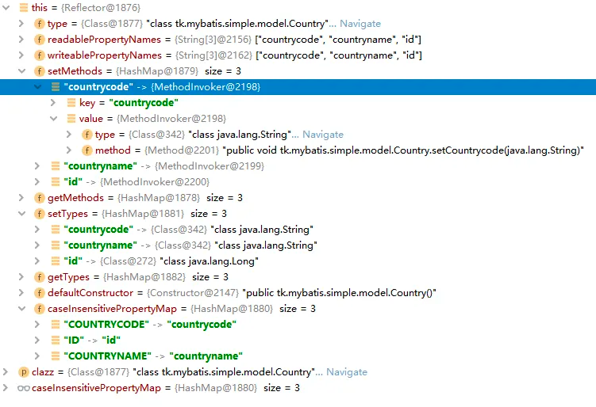

# 2.2.1 Reflector & ReflectorFactory
## Reflector
This class represents a cached set of class definition information that allows for easy mapping between property names and getter/setter methods.

Reflector MyBatis 中反射模块的基础，每个 Reflector 对象都对应一个类，在 Reflector缓存了反射操作需要使用的类的元信息。

**核心字段**

```java
public class Reflector {
    private static final String[] EMPTY_STRING_ARRAY = new String[0];

    private Class<?> type //对应的Class类型
    private String[] readablePropertyNames = EMPTY_STRING_ARRAY;
    private String[] writeablePropertyNames = EMPTY_STRING_ARRAY;
    //属性相应的setter方法，key是属性名称，value时Invoke对象，与setter方法对应
    private Map<String, Invoker> setMethods = new HashMap<String, Invoker>();
    private Map<String, Invoker> getMethods = new HashMap<String, Invoker>();
    //value是属性相应的setter方法的参数值类型
    private Map<String, Class<?>> setTypes = new HashMap<String, Class<?>>();
    private Map<String, Class<?>> getTypes = new HashMap<String, Class<?>>();
    private Constructor<?> defaultConstructor;

    //所有属性名称的集合
    private Map<String, String> caseInsensitivePropertyMap = new HashMap<String, String>();
}

```

解析指定的 Class 对象，并填充上述集合
### Reflector(Class<?> clazz)
```java
public class Reflector { 
    public Reflector(Class<?> clazz) {
        type = clazz;
        addDefaultConstructor(clazz);
        addGetMethods(clazz);
        addSetMethods(clazz);
        addFields(clazz);
        readablePropertyNames = getMethods.keySet().toArray(new String[getMethods.keySet().size()]);
        writeablePropertyNames = setMethods.keySet().toArray(new String[setMethods.keySet().size()]);
        for (String propName : readablePropertyNames) {
            caseInsensitivePropertyMap.put(propName.toUpperCase(Locale.ENGLISH), propName);
        }
        for (String propName : writeablePropertyNames) {
            caseInsensitivePropertyMap.put(propName.toUpperCase(Locale.ENGLISH), propName);
        }
    }
}
```
### addDefaultConstructor(Class<?> clazz)
```java
public class Reflector {
    private void addDefaultConstructor(Class<?> clazz) {
        Constructor<?>[] consts = clazz.getDeclaredConstructors();
        for (Constructor<?> constructor : consts) {
            if (constructor.getParameterTypes().length == 0) {
                if (canAccessPrivateMethods()) {
                    try {
                        constructor.setAccessible(true);
                    } catch (Exception e) {
                        // Ignored. This is only a final precaution, nothing we can do.
                    }
                }
                if (constructor.isAccessible()) {
                    this.defaultConstructor = constructor;
                }
            }
        }
    }
}

```
### addGetMethods(Class<?> cls)
```java
public class Reflector{
    void addGetMethods(Class<?> cls) {
        Map<String, List<Method>> conflictingGetters = new HashMap<String, List<Method>>();
        //an array containing all methods declared in this class and any superclass.
        Method[] methods = getClassMethods(cls);
        for (Method method : methods) {
            String name = method.getName();
            if (name.startsWith("get") && name.length() > 3) {
                if (method.getParameterTypes().length == 0) {
                    name = PropertyNamer.methodToProperty(name);
                    addMethodConflict(conflictingGetters, name, method);
                }
            } else if (name.startsWith("is") && name.length() > 2) {
                if (method.getParameterTypes().length == 0) {
                    name = PropertyNamer.methodToProperty(name);
                    addMethodConflict(conflictingGetters, name, method);
                }
            }
        }
        resolveGetterConflicts(conflictingGetters);
    }
}
```
### GetFieldInvoker
```java
public class GetFieldInvoker implements Invoker {
  private Field field;

  public GetFieldInvoker(Field field) {
    this.field = field;
  }

  @Override
  public Object invoke(Object target, Object[] args) throws IllegalAccessException, InvocationTargetException {
    return field.get(target);
  }

  @Override
  public Class<?> getType() {
    return field.getType();
  }
}
```
### MethodInvoker
```java
public class MethodInvoker implements Invoker {

  private Class<?> type;
  private Method method;

  public MethodInvoker(Method method) {
    this.method = method;

    if (method.getParameterTypes().length == 1) {
      type = method.getParameterTypes()[0];
    } else {
      type = method.getReturnType();
    }
  }

  @Override
  public Object invoke(Object target, Object[] args) throws IllegalAccessException, InvocationTargetException {
    return method.invoke(target, args);
  }

  @Override
  public Class<?> getType() {
    return type;
  }
}
```
### 实战
```java
@Data
public class Country {
	private Long id;
	private String countryname;
	private String countrycode;
}
```

## ReflectorFactory
实现对 reflector 对象的创建和缓存
```java
public interface ReflectorFactory {

  boolean isClassCacheEnabled();

  void setClassCacheEnabled(boolean classCacheEnabled);

  Reflector findForClass(Class<?> type);
}
```
```java
public class DefaultReflectorFactory implements ReflectorFactory {
  private boolean classCacheEnabled = true;
  private final ConcurrentMap<Class<?>, Reflector> reflectorMap = new ConcurrentHashMap<Class<?>, Reflector>();

  //为指定的 class 创建 Reflector 对象，并将 Reflector 对象缓存到 reflectorMap 中，  
  @Override
  public Reflector findForClass(Class<?> type) {
      //是否开启缓存
    if (classCacheEnabled) {
      Reflector cached = reflectorMap.get(type);
      if (cached == null) {
        cached = new Reflector(type);
        reflectorMap.put(type, cached);
      }
      return cached;
    } else {
      return new Reflector(type);
    }
  }

}
```


