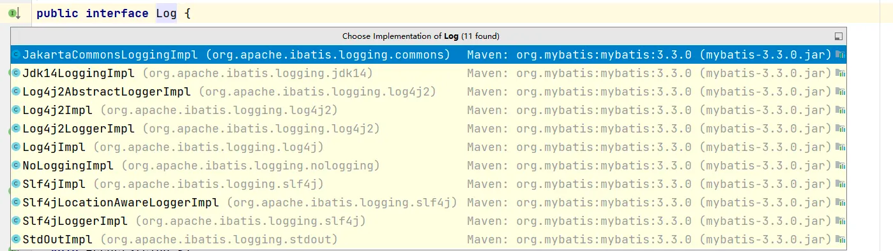

MyBatis中提供了四种日志级别：trace,debug,warn,error

第三方日志组件有各自的Log级别，且都有所不同。

因此若在MyBatis中使用第三方日志组件，则需要使用适配器进行适配
# Log
MyBatis提供的日志接口
```java
public interface Log {

  boolean isDebugEnabled();

  boolean isTraceEnabled();

  void error(String s, Throwable e);

  void error(String s);

  void debug(String s);

  void trace(String s);

  void warn(String s);

}
```

# LogFactory
按序加载并实例化对应日志组件的适配器，然后在logConstructor中记录当前使用的第三方日志组件
```java
public final class LogFactory {

  /**
   * Marker to be used by logging implementations that support markers.
   */
  public static final String MARKER = "MYBATIS";

    //第三方日志组件的构造方法
  private static Constructor<? extends Log> logConstructor;

  static {
    tryImplementation(LogFactory::useSlf4jLogging);
    tryImplementation(LogFactory::useCommonsLogging);
    tryImplementation(LogFactory::useLog4J2Logging);
    tryImplementation(LogFactory::useLog4JLogging);
    tryImplementation(LogFactory::useJdkLogging);
    tryImplementation(LogFactory::useNoLogging);
  }

  private LogFactory() {
    // disable construction
  }

  public static Log getLog(Class<?> clazz) {
    return getLog(clazz.getName());
  }

    //获取日志
  public static Log getLog(String logger) {
    try {
      return logConstructor.newInstance(logger);
    } catch (Throwable t) {
      throw new LogException("Error creating logger for logger " + logger + ".  Cause: " + t, t);
    }
  }

    private static void tryImplementation(Runnable runnable) {
        if (logConstructor == null) {
            try {
                runnable.run();
            } catch (Throwable t) {
                // ignore
            }
        }
    }

    private static void setImplementation(Class<? extends Log> implClass) {
        try {
            //第三方日志组件适配器的构造方法
            Constructor<? extends Log> candidate = implClass.getConstructor(String.class);
            Log log = candidate.newInstance(LogFactory.class.getName());
            if (log.isDebugEnabled()) {
                log.debug("Logging initialized using '" + implClass + "' adapter.");
            }
            logConstructor = candidate;
        } catch (Throwable t) {
            throw new LogException("Error setting Log implementation.  Cause: " + t, t);
        }
    }
  
    //定制化第三方日志组件
  public static synchronized void useCustomLogging(Class<? extends Log> clazz) { 
      setImplementation(clazz); 
  }
  
  public static synchronized void useSlf4jLogging() { setImplementation(org.apache.ibatis.logging.slf4j.Slf4jImpl.class); }
  public static synchronized void useCommonsLogging() { setImplementation(org.apache.ibatis.logging.commons.JakartaCommonsLoggingImpl.class); }
  public static synchronized void useLog4JLogging() { setImplementation(org.apache.ibatis.logging.log4j.Log4jImpl.class); }
  public static synchronized void useLog4J2Logging() { setImplementation(org.apache.ibatis.logging.log4j2.Log4j2Impl.class); }
  public static synchronized void useJdkLogging() { setImplementation(org.apache.ibatis.logging.jdk14.Jdk14LoggingImpl.class); }
  public static synchronized void useStdOutLogging() { setImplementation(org.apache.ibatis.logging.stdout.StdOutImpl.class); }
  public static synchronized void useNoLogging() { setImplementation(org.apache.ibatis.logging.nologging.NoLoggingImpl.class); }
}
```
# Slf4jImpl
```java
public class Slf4jImpl implements Log {

  private Log log;

  public Slf4jImpl(String clazz) {
    Logger logger = LoggerFactory.getLogger(clazz);

    if (logger instanceof LocationAwareLogger) {
      try {
          
        logger.getClass().getMethod("log", Marker.class, String.class, int.class, String.class, Object[].class, Throwable.class);
        log = new Slf4jLocationAwareLoggerImpl((LocationAwareLogger) logger);
        return;
      } catch (SecurityException | NoSuchMethodException e) {
        // fail-back to Slf4jLoggerImpl
      }
    }

    log = new Slf4jLoggerImpl(logger);
  }

  @Override
  public boolean isDebugEnabled() {
    return log.isDebugEnabled();
  }

  @Override
  public boolean isTraceEnabled() {
    return log.isTraceEnabled();
  }

  @Override
  public void error(String s, Throwable e) {
    log.error(s, e);
  }

  @Override
  public void error(String s) {
    log.error(s);
  }

  @Override
  public void debug(String s) {
    log.debug(s);
  }

  @Override
  public void trace(String s) {
    log.trace(s);
  }

  @Override
  public void warn(String s) {
    log.warn(s);
  }

}
```
# 入口
```xml
<settings>
	<setting name="logImpl" value="STDOUT_LOGGING"/>
</settings>
```
```java
public class XMLConfigBuilder extends BaseBuilder {
    
    private void parseConfiguration(XNode root) {
    try {
      // issue #117 read properties first
      propertiesElement(root.evalNode("properties"));
      Properties settings = settingsAsProperties(root.evalNode("settings"));
      
      loadCustomLogImpl(settings);
      
    } catch (Exception e) {
      throw new BuilderException("Error parsing SQL Mapper Configuration. Cause: " + e, e);
    }
  }

  private void loadCustomLogImpl(Properties props) {
    Class<? extends Log> logImpl = resolveClass(props.getProperty("logImpl"));
    configuration.setLogImpl(logImpl);
  }  
}
```
```java
public class Configuration{
    public void setLogImpl(Class<? extends Log> logImpl) {
    if (logImpl != null) {
      this.logImpl = logImpl;
      LogFactory.useCustomLogging(this.logImpl);
    }
  }
}
```

