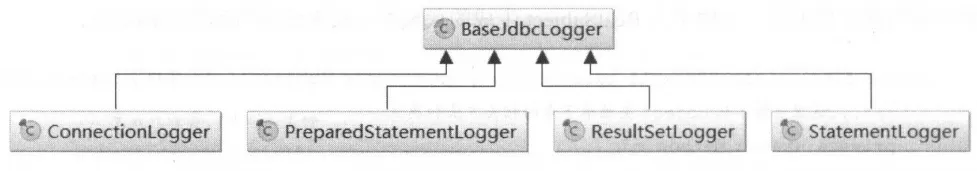

```
DEBUG [main] - ==>  Preparing: select id,countryname,countrycode from country 
DEBUG [main] - ==> Parameters: 
TRACE [main] - <==    Columns: id, countryname, countrycode
TRACE [main] - <==        Row: 1, 中国, CN
TRACE [main] - <==        Row: 2, 美国, US
TRACE [main] - <==        Row: 3, 俄罗斯, RU
TRACE [main] - <==        Row: 4, 英国, GB
TRACE [main] - <==        Row: 5, 法国, FR
DEBUG [main] - <==      Total: 5
```
# BaseJdbcLogger
通过 JDK 动态代理，将 JDBC 操作通过制定的日志框架打印出来。

可以输出 SQL 语句、用户传入的绑定参数、SQL 语句影响行数等等信息
```java
public abstract class BaseJdbcLogger {

  protected static final Set<String> SET_METHODS = new HashSet<String>();
  protected static final Set<String> EXECUTE_METHODS = new HashSet<String>();

  private Map<Object, Object> columnMap = new HashMap<Object, Object>();

  private List<Object> columnNames = new ArrayList<Object>();
  private List<Object> columnValues = new ArrayList<Object>();

  protected Log statementLog;
  protected int queryStack;

  /*
   * Default constructor
   */
  public BaseJdbcLogger(Log log, int queryStack) {
    this.statementLog = log;
    if (queryStack == 0) {
      this.queryStack = 1;
    } else {
      this.queryStack = queryStack;
    }
  }

  static {
    SET_METHODS.add("setString");
    SET_METHODS.add("setNString");
    SET_METHODS.add("setInt");
    //...

    EXECUTE_METHODS.add("execute");
    EXECUTE_METHODS.add("executeUpdate");
    EXECUTE_METHODS.add("executeQuery");
    EXECUTE_METHODS.add("addBatch");
  }


  protected String getParameterValueString() {
    List<Object> typeList = new ArrayList<Object>(columnValues.size());
    for (Object value : columnValues) {
      if (value == null) {
        typeList.add("null");
      } else {
        typeList.add(value + "(" + value.getClass().getSimpleName() + ")");
      }
    }
    final String parameters = typeList.toString();
    return parameters.substring(1, parameters.length() - 1);
  }
    
  protected void clearColumnInfo() {
    columnMap.clear();
    columnNames.clear();
    columnValues.clear();
  }

  protected boolean isDebugEnabled() {
    return statementLog.isDebugEnabled();
  }

  protected boolean isTraceEnabled() {
    return statementLog.isTraceEnabled();
  }

}
```
# ConnectionLogger
```java
public final class ConnectionLogger extends BaseJdbcLogger implements InvocationHandler {

  private Connection connection;

  private ConnectionLogger(Connection conn, Log statementLog, int queryStack) {
    super(statementLog, queryStack);
    this.connection = conn;
  }

  @Override
  public Object invoke(Object proxy, Method method, Object[] params)
      throws Throwable {
    try {
      if (Object.class.equals(method.getDeclaringClass())) {
        return method.invoke(this, params);
      }    
      if ("prepareStatement".equals(method.getName())) {
        if (isDebugEnabled()) {
            //Preparing: select * from student where sno=?
          debug(" Preparing: " + removeBreakingWhitespace((String) params[0]), true);
        }        
        PreparedStatement stmt = (PreparedStatement) method.invoke(connection, params);
        stmt = PreparedStatementLogger.newInstance(stmt, statementLog, queryStack);
        return stmt;
      } else if ("prepareCall".equals(method.getName())) {
        if (isDebugEnabled()) {
          debug(" Preparing: " + removeBreakingWhitespace((String) params[0]), true);
        }        
        PreparedStatement stmt = (PreparedStatement) method.invoke(connection, params);
        stmt = PreparedStatementLogger.newInstance(stmt, statementLog, queryStack);
        return stmt;
      } else if ("createStatement".equals(method.getName())) {
        Statement stmt = (Statement) method.invoke(connection, params);
        stmt = StatementLogger.newInstance(stmt, statementLog, queryStack);
        return stmt;
      } else {
        return method.invoke(connection, params);
      }
    } catch (Throwable t) {
      throw ExceptionUtil.unwrapThrowable(t);
    }
  }

  /*
   * Creates a logging version of a connection
   *
   * @param conn - the original connection
   * @return - the connection with logging
   */
  public static Connection newInstance(Connection conn, Log statementLog, int queryStack) {
    InvocationHandler handler = new ConnectionLogger(conn, statementLog, queryStack);
    ClassLoader cl = Connection.class.getClassLoader();
    return (Connection) Proxy.newProxyInstance(cl, new Class[]{Connection.class}, handler);
  }

  /*
   * return the wrapped connection
   */
  public Connection getConnection() {
    return connection;
  }

}
```
# PreparedStatementLogger
`PreparedStatementLogger` 中封装了 `PreparedStatement` 对象
```java
public final class PreparedStatementLogger extends BaseJdbcLogger implements InvocationHandler {

  private PreparedStatement statement;

  private PreparedStatementLogger(PreparedStatement stmt, Log statementLog, int queryStack) {
    super(statementLog, queryStack);
    this.statement = stmt;
  }

  @Override
  public Object invoke(Object proxy, Method method, Object[] params) throws Throwable {
    try {
      if (Object.class.equals(method.getDeclaringClass())) {
        return method.invoke(this, params);
      }          
      if (EXECUTE_METHODS.contains(method.getName())) {
        if (isDebugEnabled()) {
            //Parameters: 2(String)
          debug("Parameters: " + getParameterValueString(), true);
        }
        clearColumnInfo();
        if ("executeQuery".equals(method.getName())) {
          ResultSet rs = (ResultSet) method.invoke(statement, params);
          return rs == null ? null : ResultSetLogger.newInstance(rs, statementLog, queryStack);
        } else {
          return method.invoke(statement, params);
        }
      } else if (SET_METHODS.contains(method.getName())) {
        if ("setNull".equals(method.getName())) {
          setColumn(params[0], null);
        } else {
          setColumn(params[0], params[1]);
        }
        return method.invoke(statement, params);
      } else if ("getResultSet".equals(method.getName())) {
        ResultSet rs = (ResultSet) method.invoke(statement, params);
        return rs == null ? null : ResultSetLogger.newInstance(rs, statementLog, queryStack);
      } else if ("getUpdateCount".equals(method.getName())) {
        int updateCount = (Integer) method.invoke(statement, params);
        if (updateCount != -1) {
          debug("   Updates: " + updateCount, false);
        }
        return updateCount;
      } else {
        return method.invoke(statement, params);
      }
    } catch (Throwable t) {
      throw ExceptionUtil.unwrapThrowable(t);
    }
  }

  /*
   * Creates a logging version of a PreparedStatement
   */
  public static PreparedStatement newInstance(PreparedStatement stmt, Log statementLog, int queryStack) {
    InvocationHandler handler = new PreparedStatementLogger(stmt, statementLog, queryStack);
    ClassLoader cl = PreparedStatement.class.getClassLoader();
    return (PreparedStatement) Proxy.newProxyInstance(cl, new Class[]{PreparedStatement.class, CallableStatement.class}, handler);
  }

}
```
# StatementLogger
```java
public final class StatementLogger extends BaseJdbcLogger implements InvocationHandler {

  private Statement statement;

  private StatementLogger(Statement stmt, Log statementLog, int queryStack) {
    super(statementLog, queryStack);
    this.statement = stmt;
  }

  @Override
  public Object invoke(Object proxy, Method method, Object[] params) throws Throwable {
    try {
      if (Object.class.equals(method.getDeclaringClass())) {
        return method.invoke(this, params);
      }    
      if (EXECUTE_METHODS.contains(method.getName())) {
        if (isDebugEnabled()) {
          debug(" Executing: " + removeBreakingWhitespace((String) params[0]), true);
        }
        if ("executeQuery".equals(method.getName())) {
          ResultSet rs = (ResultSet) method.invoke(statement, params);
          return rs == null ? null : ResultSetLogger.newInstance(rs, statementLog, queryStack);
        } else {
          return method.invoke(statement, params);
        }
      } else if ("getResultSet".equals(method.getName())) {
        ResultSet rs = (ResultSet) method.invoke(statement, params);
        return rs == null ? null : ResultSetLogger.newInstance(rs, statementLog, queryStack);
      } else {
        return method.invoke(statement, params);
      }
    } catch (Throwable t) {
      throw ExceptionUtil.unwrapThrowable(t);
    }
  }

  /*
   * Creates a logging version of a Statement
   */
  public static Statement newInstance(Statement stmt, Log statementLog, int queryStack) {
    InvocationHandler handler = new StatementLogger(stmt, statementLog, queryStack);
    ClassLoader cl = Statement.class.getClassLoader();
    return (Statement) Proxy.newProxyInstance(cl, new Class[]{Statement.class}, handler);
  }

  /*
   * return the wrapped statement
   */
  public Statement getStatement() {
    return statement;
  }

}
```
# ResultSetLogger
```java
public final class ResultSetLogger extends BaseJdbcLogger implements InvocationHandler {

  private static Set<Integer> BLOB_TYPES = new HashSet<Integer>();
  private boolean first = true;
  private int rows = 0;
  private ResultSet rs;
  private Set<Integer> blobColumns = new HashSet<Integer>();

  static {
    BLOB_TYPES.add(Types.BINARY);
    BLOB_TYPES.add(Types.BLOB);
    BLOB_TYPES.add(Types.CLOB);
    BLOB_TYPES.add(Types.LONGNVARCHAR);
    BLOB_TYPES.add(Types.LONGVARBINARY);
    BLOB_TYPES.add(Types.LONGVARCHAR);
    BLOB_TYPES.add(Types.NCLOB);
    BLOB_TYPES.add(Types.VARBINARY);
  }
  
  private ResultSetLogger(ResultSet rs, Log statementLog, int queryStack) {
    super(statementLog, queryStack);
    this.rs = rs;
  }

  @Override
  public Object invoke(Object proxy, Method method, Object[] params) throws Throwable {
    try {
      if (Object.class.equals(method.getDeclaringClass())) {
        return method.invoke(this, params);
      }    
      Object o = method.invoke(rs, params);
      if ("next".equals(method.getName())) {
        if (((Boolean) o)) {
          rows++;
          if (isTraceEnabled()) {
            ResultSetMetaData rsmd = rs.getMetaData();
            final int columnCount = rsmd.getColumnCount();
            if (first) {
              first = false;
                //Columns: sno, sname, ssex
              printColumnHeaders(rsmd, columnCount);
            }
              //Row: 2, zyx, man
            printColumnValues(columnCount);
          }
        } else {
          debug("     Total: " + rows, false);
        }
      }
      clearColumnInfo();
      return o;
    } catch (Throwable t) {
      throw ExceptionUtil.unwrapThrowable(t);
    }
  }

  private void printColumnHeaders(ResultSetMetaData rsmd, int columnCount) throws SQLException {
    StringBuilder row = new StringBuilder();
    row.append("   Columns: ");
    for (int i = 1; i <= columnCount; i++) {
      if (BLOB_TYPES.contains(rsmd.getColumnType(i))) {
        blobColumns.add(i);
      }
      String colname = rsmd.getColumnLabel(i);
      row.append(colname);
      if (i != columnCount) {
        row.append(", ");
      }
    }
    trace(row.toString(), false);
  }

  private void printColumnValues(int columnCount) {
    StringBuilder row = new StringBuilder();
    row.append("       Row: ");
    for (int i = 1; i <= columnCount; i++) {
      String colname;
      try {
        if (blobColumns.contains(i)) {
          colname = "<<BLOB>>";
        } else {
          colname = rs.getString(i);
        }
      } catch (SQLException e) {
        // generally can't call getString() on a BLOB column
        colname = "<<Cannot Display>>";
      }
      row.append(colname);
      if (i != columnCount) {
        row.append(", ");
      }
    }
    trace(row.toString(), false);
  }

  /*
   * Creates a logging version of a ResultSet
   */
  public static ResultSet newInstance(ResultSet rs, Log statementLog, int queryStack) {
    InvocationHandler handler = new ResultSetLogger(rs, statementLog, queryStack);
    ClassLoader cl = ResultSet.class.getClassLoader();
    return (ResultSet) Proxy.newProxyInstance(cl, new Class[]{ResultSet.class}, handler);
  }

}
```


