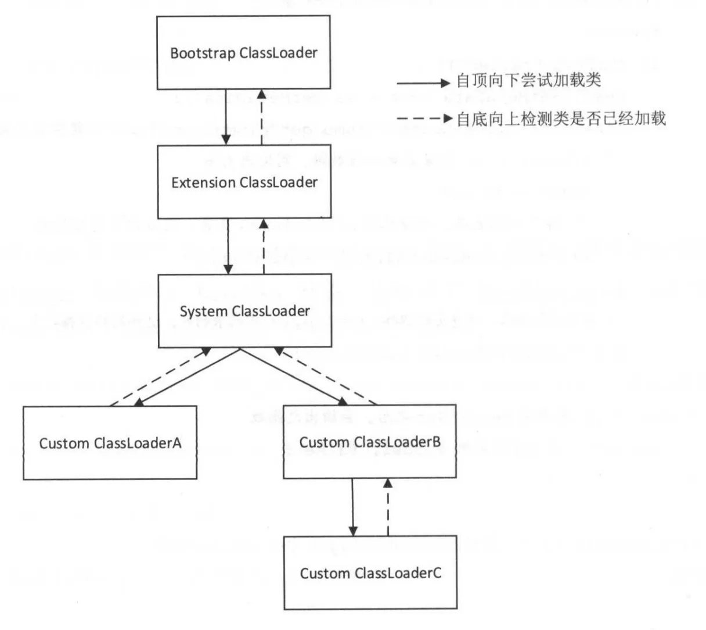

# 类加载器的作用
Java 虚拟机中的类加载器（ ClassLoader ）负责加载来自文件系统、网络或其他来源的类文件。
# 三种默认使用的类加载器
Bootstrap ClassLoader,Extension ClassLoader,System ClassLoader （也被称为 pplication ClassLoader ），每种类加载器都己经确定从哪个位置加载类文件。

# 双亲委派机制
Java 虚拟机中的类加载器默认使用的是双亲委派模式

