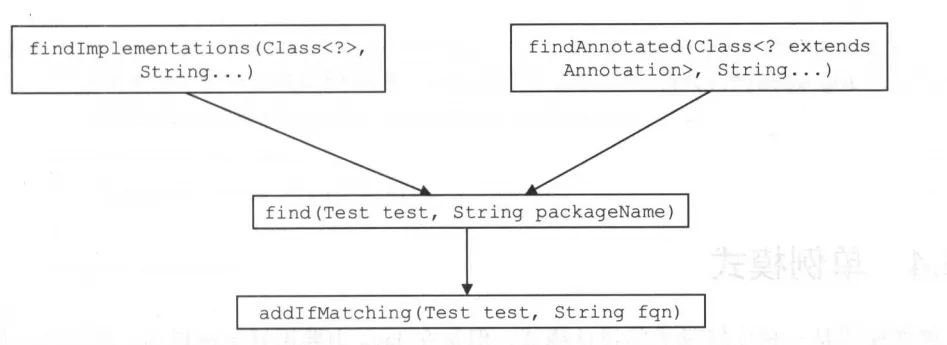

`to locate classes that are available in the/a class path and meet arbitrary conditions. The two most common conditions are that a class implements/extends another class, or that is it annotated with a specific annotation. `

# 默认类加载器

```java
public class ResolverUtil<T> {
    /**
     * The ClassLoader to use when looking for classes. If null then the ClassLoader returned
     * by Thread.currentThread().getContextClassLoader() will be used.
     */
    private ClassLoader classloader;

    public ClassLoader getClassLoader() {
        return classloader == null ? Thread.currentThread().getContextClassLoader() : classloader;
    }
}
```

# 匹配接口

```java
public static interface Test {
    /**
     * Will be called repeatedly with candidate classes. Must return True if a class
     * is to be included in the results, false otherwise.
     */
    boolean matches(Class<?> type);
}
```

# 获取某个类的子类或实现类

## IsA

```java
public class ResolverUtil<T> {
    /**
     * A Test that checks to see if each class is assignable to the provided class. Note
     * that this test will match the parent type itself if it is presented for matching.
     */
    public static class IsA implements Test {
        private Class<?> parent;

        /** Constructs an IsA test using the supplied Class as the parent class/interface. */
        public IsA(Class<?> parentType) {
            this.parent = parentType;
        }

        /** Returns true if type is assignable to the parent type supplied in the constructor. */
        @Override
        public boolean matches(Class<?> type) {
            return type != null && parent.isAssignableFrom(type);
        }

        @Override
        public String toString() {
            return "is assignable to " + parent.getSimpleName();
        }
    }
}
```

## findImplementations()

```java
public class ResolverUtil<T> {
    public ResolverUtil<T> findImplementations(Class<?> parent, String... packageNames) {
        if (packageNames == null) {
            return this;
        }

        Test test = new IsA(parent);
        for (String pkg : packageNames) {
            find(test, pkg);
        }

        return this;
    }
}
```

# 获取标有某个注解的类

## AnnotatedWith

```java
public class ResolverUtil<T> {
    /**
     * A Test that checks to see if each class is annotated with a specific annotation. If it
     * is, then the test returns true, otherwise false.
     */
    public static class AnnotatedWith implements Test {
        private Class<? extends Annotation> annotation;

        /** Constructs an AnnotatedWith test for the specified annotation type. */
        public AnnotatedWith(Class<? extends Annotation> annotation) {
            this.annotation = annotation;
        }

        /** Returns true if the type is annotated with the class provided to the constructor. */
        @Override
        public boolean matches(Class<?> type) {
            return type != null && type.isAnnotationPresent(annotation);
        }

        @Override
        public String toString() {
            return "annotated with @" + annotation.getSimpleName();
        }
    }
}
```

## findAnnotated()

```java
public class ResolverUtil<T> {
    /**
     * Attempts to discover classes that are annotated with the annotation. 
     */
    public ResolverUtil<T> findAnnotated(Class<? extends Annotation> annotation, String... packageNames) {
        if (packageNames == null) {
            return this;
        }

        Test test = new AnnotatedWith(annotation);
        for (String pkg : packageNames) {
            find(test, pkg);
        }

        return this;
    }
}

```

# find()



_上面两个方法，都是最终通过调用这个方法来对应的类_

```java
public class ResolverUtil<T> {
    /**
     * Scans for classes starting at the package provided and descending into subpackages.
     * Each class is offered up to the Test as it is discovered
     */
    public ResolverUtil<T> find(Test test, String packageName) {
        String path = getPackagePath(packageName);

        try {
            //通过VFS.list()查找packageName包下的所有资源
            List<String> children = VFS.getInstance().list(path);
            for (String child : children) {
                if (child.endsWith(".class")) {
                    addIfMatching(test, child);
                }
            }
        } catch (IOException ioe) {
            log.error("Could not read package: " + packageName, ioe);
        }

        return this;
    }

    protected void addIfMatching(Test test, String fqn) {
        try {
            String externalName = fqn.substring(0, fqn.indexOf('.')).replace('/', '.');
            ClassLoader loader = getClassLoader();
            if (log.isDebugEnabled()) {
                log.debug("Checking to see if class " + externalName + " matches criteria [" + test + "]");
            }

            Class<?> type = loader.loadClass(externalName);
            if (test.matches(type)) {
                matches.add((Class<T>) type);
            }
        } catch (Throwable t) {
            log.warn("Could not examine class '" + fqn + "'" + " due to a " +
                    t.getClass().getName() + " with message: " + t.getMessage());
        }
    }
}
```


