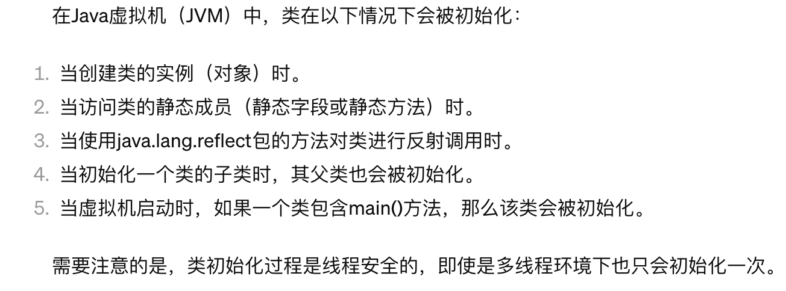

# 作用

避免了频繁地创建对象，所以可以减少 GC 次数，也比较节省内存资源，加快对象访问速度。

# 饿汉式

```java
public class Sington {
    private Sington() {
    }

    private static Sington sington = new Sington();

    public static Sington getInstance() {
        return sington;
    }
}
```

# 懒汉式

```java
public class Sington {

    private static Sington Sington;

    private Sington() {
    }

    public static Sington getInstance() {
        if (Sington == null) {
            Sington = new Sington();
        }
        return Sington;
    }
}
```

_多线程场景中可能存在并发问题_

# 双重检查锁定

```java
public class Sington {

    //加上volatile，防止因为指令重排优化导致系统出现异常行为
    private volatile static Sington instance;

    private Sington() {
    }

    public static Sington getInstance() {
        if (instance == null) {
            synchronized (Sington.class) {
                if (instance == null) {
                    return instance = new Sington();
                }
            }
        }
        return instance;
    }
}
```

# 静态内部类的单例模式

类加载机制保证只创建一个单例对象。

延迟加载：当第一次访问类中的静态字段时，会出现类加载。

```java
public class Sington {

    private Sington() {
    }

    private static class SingletonHolder {
        public static Sington instance = new Sington();
    }

    public static Sington newInstance() {
        return SingletonHolder.instance;
    }
}
```




