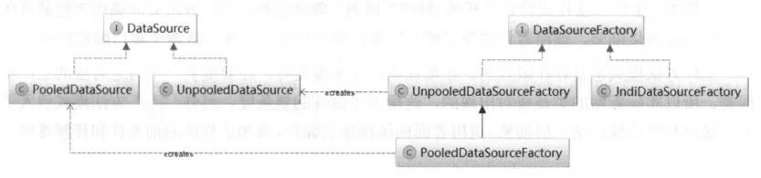
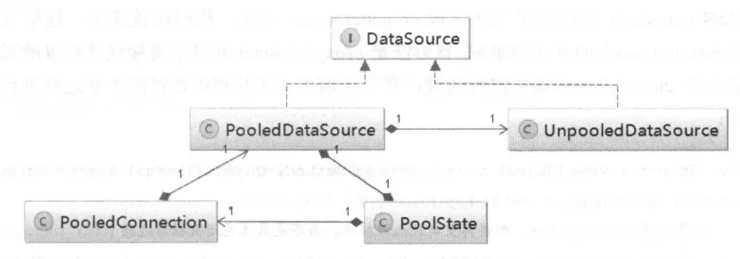
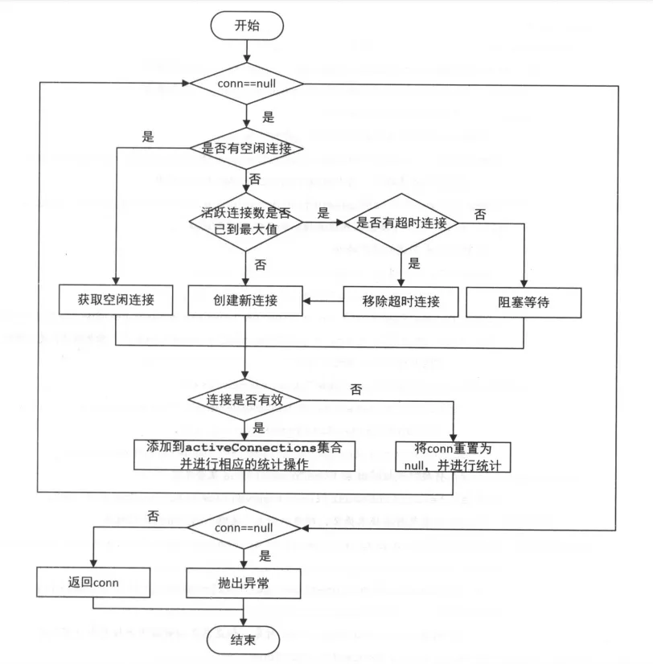
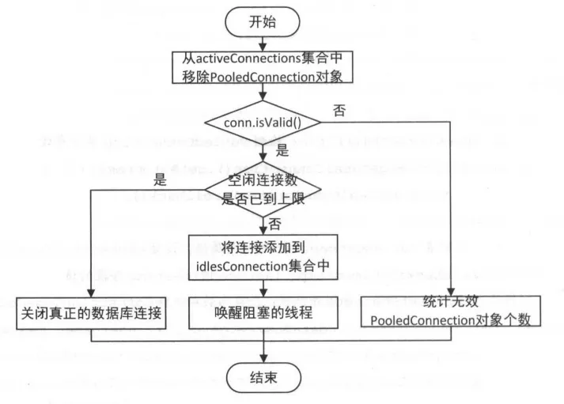

# 2.6.1 工厂方法模式

# 2.6.2 DataSourceFactory

```java
public interface DataSourceFactory {

    //设置DataSource的相关属性，一般紧跟在初始化完成之后
    void setProperties(Properties props);

    DataSource getDataSource();

}
```

`UnpooledDataSourceFactory`和`PooledDataSourceFactory` 不同是getDataSource()中返回的dataSource不同

## UnpooledDataSourceFactory

```java
public class UnpooledDataSourceFactory implements DataSourceFactory {

    private static final String DRIVER_PROPERTY_PREFIX = "driver.";
    private static final int DRIVER_PROPERTY_PREFIX_LENGTH = DRIVER_PROPERTY_PREFIX.length();

    protected DataSource dataSource;

    public UnpooledDataSourceFactory() {
        this.dataSource = new UnpooledDataSource();
    }

    @Override
    public void setProperties(Properties properties) {
        //...
    }

    @Override
    public DataSource getDataSource() {
        return dataSource;
    }

}
```

## PooledDataSourceFactory

```java
public class PooledDataSourceFactory extends UnpooledDataSourceFactory {

    public PooledDataSourceFactory() {
        this.dataSource = new PooledDataSource();
    }

}
```

# 2.6.3 UnpooledDataSource

```java
public class UnpooledDataSource implements DataSource {

    private ClassLoader driverClassLoader;
    private Properties driverProperties;
    //缓存所有已注册的数据库驱动
    private static Map<String, Driver> registeredDrivers = new ConcurrentHashMap<String, Driver>();

    private String driver;
    private String url;
    private String username;
    private String password;

    private Boolean autoCommit;
    private Integer defaultTransactionIsolationLevel;//事务隔离级别

    static {
        //将已在 DriverManager 中注册的 JDBC Driver 复制一份到 registeredDrivers 中
        Enumeration<Driver> drivers = DriverManager.getDrivers();
        while (drivers.hasMoreElements()) {
            Driver driver = drivers.nextElement();
            registeredDrivers.put(driver.getClass().getName(), driver);
        }
    }

    private Connection doGetConnection(Properties properties) throws SQLException {
        initializeDriver();//初始化数据库驱动
        Connection connection = DriverManager.getConnection(url, properties);//创建真正的数据库连接
        configureConnection(connection);//配置数据库连接的autoCommit和隔离级别
        return connection;
    }

    private synchronized void initializeDriver() throws SQLException {
        if (!registeredDrivers.containsKey(driver)) {
            Class<?> driverType;
            try {
                if (driverClassLoader != null) {
                    driverType = Class.forName(driver, true, driverClassLoader);
                } else {
                    driverType = Resources.classForName(driver);
                }
                // DriverManager requires the driver to be loaded via the system ClassLoader.
                // http://www.kfu.com/~nsayer/Java/dyn-jdbc.html
                Driver driverInstance = (Driver) driverType.newInstance();
                DriverManager.registerDriver(new DriverProxy(driverInstance));
                registeredDrivers.put(driver, driverInstance);
            } catch (Exception e) {
                throw new SQLException("Error setting driver on UnpooledDataSource. Cause: " + e);
            }
        }
    }

    private void configureConnection(Connection conn) throws SQLException {
        if (autoCommit != null && autoCommit != conn.getAutoCommit()) {
            conn.setAutoCommit(autoCommit);
        }
        if (defaultTransactionIsolationLevel != null) {
            conn.setTransactionIsolation(defaultTransactionIsolationLevel);
        }
    }

}

```

# 2.6.4 pooledDataSource

## PooledConnection

`PooledDataSource` 并不会直接管理 `java.sqI.Connection` 对象，而是管理 `PooledConnection` 对象

当调用连接的代理对象的 Close()方法时，并未关闭真正的数据连接，而是调用 PooledDataSource.pushConnection()方法将PooledConnection 对象归还给连接池

### 核心字段

```java
class PooledConnection implements InvocationHandler {

    private static final String CLOSE = "close";
    private static final Class<?>[] IFACES = new Class<?>[]{Connection.class};

    private int hashCode = 0;
    //记录当前PooledConnection对象所在的PooledDataSource对象。该PooledConnection是从该PooledDataSource中获取的；
    //当调用close()方法时会将PooledConnection放回该PooledDataSource中
    private PooledDataSource dataSource;
    //真正的数据库连接
    private Connection realConnection;
    //数据库连接的代理对象
    private Connection proxyConnection;
    // 由数据库 URL 、用户名和密码计算出来的 hash 佳，可用于标识该连接所在的连接池
    private int connectionTypeCode;
    //检测 当前 PooledConnection 是否有效，主要是为了防止程序通过 close （）方法将连接归还给连接池之后，依
    //然通过该连接操作数据库
    private boolean valid;

    public PooledConnection(Connection connection, PooledDataSource dataSource) {
        this.hashCode = connection.hashCode();
        this.realConnection = connection;
        this.dataSource = dataSource;
        this.createdTimestamp = System.currentTimeMillis();
        this.lastUsedTimestamp = System.currentTimeMillis();
        this.valid = true;
        this.proxyConnection = (Connection) Proxy.newProxyInstance(Connection.class.getClassLoader(), IFACES, this);
    }

}
```

### 实际调用的代理类方法

```java
class PooledConnection implements InvocationHandler {
    public Object invoke(Object proxy, Method method, Object[] args) throws Throwable {
        String methodName = method.getName();
        //如果调用 close （）方法，则将其重新放入连接池，而不是真正关闭数据库连接
        if (CLOSE.hashCode() == methodName.hashCode() && CLOSE.equals(methodName)) {
            dataSource.pushConnection(this);
            return null;
        } else {
            try {
                if (!Object.class.equals(method.getDeclaringClass())) {
                    // throw an SQLException instead of a Runtime
                    checkConnection();
                }
                return method.invoke(realConnection, args);// 调用真正数据库连接对象的对应方法
            } catch (Throwable t) {
                throw ExceptionUtil.unwrapThrowable(t);
            }
        }
    }
}
```

### 测试链接是否正常

```java
class PooledConnection implements InvocationHandler {

    /*
     * Invalidates the connection
     */
    public void invalidate() {
        valid = false;
    }

    /*
     * Method to see if the connection is usable
     */
    public boolean isValid() {
        return valid && realConnection != null && dataSource.pingConnection(this);
    }

    private void checkConnection() throws SQLException {
        if (!valid) {
            throw new SQLException("Error accessing PooledConnection. Connection is invalid.");
        }
    }
}
```

## PoolState

用于管理 PooledConnection 对象状态的组件。

通过idleConnections、activeConnections 管理空闲状态的连接和活跃状态的连接

```java
public class PoolState {

    protected PooledDataSource dataSource;

    protected final List<PooledConnection> idleConnections = new ArrayList<PooledConnection>();
    protected final List<PooledConnection> activeConnections = new ArrayList<PooledConnection>();
    protected long requestCount = 0; //请求数据库连接的次数
    protected long accumulatedRequestTime = 0;
    //CheckoutTime 表示应用从连接池中取出连接，到归还连接这段时长，
    //accumulatedCheckoutTime记录了所有连接累计的 CheckoutTime 时长
    protected long accumulatedCheckoutTime = 0;

    //当连接长时间未归还给连接池时，会被认为该连接超时，claimedOverdueConnectionCount记录了超时的连接个数
    protected long claimedOverdueConnectionCount = 0;
    protected long accumulatedCheckoutTimeOfOverdueConnections = 0;//累积超时时间
    protected long accumulatedWaitTime = 0;//累积等待时间
    protected long hadToWaitCount = 0;//等待次数
    protected long badConnectionCount = 0;//无效的连接数
}
```

## PoolDataSource

`PooledDataSource` 创建新数据库连接的功能是依赖其中封装的 `UnpooledDataSource` 对象实现的。



`a simple, synchronous, thread-safe database connection pool.`

### 核心字段

```java
public class PooledDataSource implements DataSource {

    //管理连接池的状态并记录统计信息
    private final PoolState state = new PoolState(this);

    //生成真是的数据库连接对象，构造函数中汇初始化该字段
    private final UnpooledDataSource dataSource;

    protected int poolMaximumActiveConnections = 10;
    protected int poolMaximumIdleConnections = 5;
    protected int poolMaximumCheckoutTime = 20000;
    protected int poolTimeToWait = 20000;
    //在检测一个数据库连接是否可用时，会给数据库发送一个测试 SQL 语句
    protected String poolPingQuery = "NO PING QUERY SET";
    //是否允许发送测试 SQL 吾句
    protected boolean poolPingEnabled = false;

    //／当连接超 poolPingConnect onsNotUsedFor 毫秒未使用时，会发送一次测试 SQL 语句，检测连接是否正常
    protected int poolPingConnectionsNotUsedFor = 0;

    //根据数据库的 URL 用户名和密码生成的一个 hash 佳，该哈希值用于标志着当前的连接池，在构造函数中初始化
    private int expectedConnectionTypeCode;
}
```

### getConnection()

```java
public class PooledDataSource implements DataSource {
    public Connection getConnection() throws SQLException {

        //通过popConnection()方法获取方法获取PooledConnection对象对象。
        //然后通过PooledConnection.getProxyConnection()方法获取数据库连接的代理对象
        return popConnection(dataSource.getUsername(), dataSource.getPassword()).getProxyConnection();
    }
}

```

### popConnection()



```java
public class PooledDataSource implements DataSource {
    private PooledConnection popConnection(String username, String password) throws SQLException {
        boolean countedWait = false;
        PooledConnection conn = null;
        long t = System.currentTimeMillis();
        int localBadConnectionCount = 0;

        while (conn == null) {
            synchronized (state) {
                if (!state.idleConnections.isEmpty()) {
                    // Pool has available connection
                    conn = state.idleConnections.remove(0);
                    if (log.isDebugEnabled()) {
                        log.debug("Checked out connection " + conn.getRealHashCode() + " from pool.");
                    }
                } else {
                    // Pool does not have available connection
                    if (state.activeConnections.size() < poolMaximumActiveConnections) {
                        // Can create new connection
                        conn = new PooledConnection(dataSource.getConnection(), this);
                        if (log.isDebugEnabled()) {
                            log.debug("Created connection " + conn.getRealHashCode() + ".");
                        }
                    } else {
                        // Cannot create new connection
                        PooledConnection oldestActiveConnection = state.activeConnections.get(0);
                        long longestCheckoutTime = oldestActiveConnection.getCheckoutTime();
                        if (longestCheckoutTime > poolMaximumCheckoutTime) {
                            // Can claim overdue connection
                            state.claimedOverdueConnectionCount++;
                            state.accumulatedCheckoutTimeOfOverdueConnections += longestCheckoutTime;
                            state.accumulatedCheckoutTime += longestCheckoutTime;
                            state.activeConnections.remove(oldestActiveConnection);
                            if (!oldestActiveConnection.getRealConnection().getAutoCommit()) {
                                oldestActiveConnection.getRealConnection().rollback();
                            }
                            conn = new PooledConnection(oldestActiveConnection.getRealConnection(), this);
                            oldestActiveConnection.invalidate();
                            if (log.isDebugEnabled()) {
                                log.debug("Claimed overdue connection " + conn.getRealHashCode() + ".");
                            }
                        } else {
                            // Must wait
                            try {
                                if (!countedWait) {
                                    state.hadToWaitCount++;
                                    countedWait = true;
                                }
                                if (log.isDebugEnabled()) {
                                    log.debug("Waiting as long as " + poolTimeToWait + " milliseconds for connection.");
                                }
                                long wt = System.currentTimeMillis();
                                state.wait(poolTimeToWait);
                                state.accumulatedWaitTime += System.currentTimeMillis() - wt;
                            } catch (InterruptedException e) {
                                break;
                            }
                        }
                    }
                }
                if (conn != null) {
                    if (conn.isValid()) {
                        if (!conn.getRealConnection().getAutoCommit()) {
                            conn.getRealConnection().rollback();
                        }
                        conn.setConnectionTypeCode(assembleConnectionTypeCode(dataSource.getUrl(), username, password));
                        conn.setCheckoutTimestamp(System.currentTimeMillis());
                        conn.setLastUsedTimestamp(System.currentTimeMillis());
                        state.activeConnections.add(conn);
                        state.requestCount++;
                        state.accumulatedRequestTime += System.currentTimeMillis() - t;
                    } else {
                        if (log.isDebugEnabled()) {
                            log.debug("A bad connection (" + conn.getRealHashCode() + ") was returned from the pool, getting another connection.");
                        }
                        state.badConnectionCount++;
                        localBadConnectionCount++;
                        conn = null;
                        if (localBadConnectionCount > (poolMaximumIdleConnections + 3)) {
                            if (log.isDebugEnabled()) {
                                log.debug("PooledDataSource: Could not get a good connection to the database.");
                            }
                            throw new SQLException("PooledDataSource: Could not get a good connection to the database.");
                        }
                    }
                }
            }

        }

        if (conn == null) {
            if (log.isDebugEnabled()) {
                log.debug("PooledDataSource: Unknown severe error condition.  The connection pool returned a null connection.");
            }
            throw new SQLException("PooledDataSource: Unknown severe error condition.  The connection pool returned a null connection.");
        }

        return conn;
    }
}
```

### pushConnection()



```java
public class PooledDataSource implements DataSource {
    protected void pushConnection(PooledConnection conn) throws SQLException {

        synchronized (state) {
            state.activeConnections.remove(conn);
            if (conn.isValid()) {
                //检测空闲连接数是否已达到上限，以及 PooledConnection 是否为该连接池的连接
                if (state.idleConnections.size() < poolMaximumIdleConnections && conn.getConnectionTypeCode() == expectedConnectionTypeCode) {
                    state.accumulatedCheckoutTime += conn.getCheckoutTime();
                    if (!conn.getRealConnection().getAutoCommit()) {
                        conn.getRealConnection().rollback();
                    }
                    PooledConnection newConn = new PooledConnection(conn.getRealConnection(), this);
                    state.idleConnections.add(newConn);
                    newConn.setCreatedTimestamp(conn.getCreatedTimestamp());
                    newConn.setLastUsedTimestamp(conn.getLastUsedTimestamp());
                    conn.invalidate();
                    if (log.isDebugEnabled()) {
                        log.debug("Returned connection " + newConn.getRealHashCode() + " to pool.");
                    }
                    state.notifyAll();
                } else {
                    state.accumulatedCheckoutTime += conn.getCheckoutTime();
                    if (!conn.getRealConnection().getAutoCommit()) {
                        conn.getRealConnection().rollback();
                    }
                    conn.getRealConnection().close();
                    if (log.isDebugEnabled()) {
                        log.debug("Closed connection " + conn.getRealHashCode() + ".");
                    }
                    conn.invalidate();
                }
            } else {
                if (log.isDebugEnabled()) {
                    log.debug("A bad connection (" + conn.getRealHashCode() + ") attempted to return to the pool, discarding connection.");
                }
                state.badConnectionCount++;
            }
        }
    }
}
```

### pingConnection(PooledConnection conn)

```java
public class PooledDataSource implements DataSource {

    protected boolean pingConnection(PooledConnection conn) {
//记录 ping 操作是否成功
        boolean result = true;

        try {
            //检测真正的数据库连接是否已经关闭
            result = !conn.getRealConnection().isClosed();
        } catch (SQLException e) {
            if (log.isDebugEnabled()) {
                log.debug("Connection " + conn.getRealHashCode() + " is BAD: " + e.getMessage());
            }
            result = false;
        }

        if (result) {
            //是否运行执行测试 SQL 语句
            if (poolPingEnabled) {
                //长时间（超过 poolPingConnectionsNotUsedFor 指定的时长）未使用的连接，才需要 ping 操作来检测数据库连接是否正
                if (poolPingConnectionsNotUsedFor >= 0 && conn.getTimeElapsedSinceLastUse() > poolPingConnectionsNotUsedFor) {
                    try {
                        if (log.isDebugEnabled()) {
                            log.debug("Testing connection " + conn.getRealHashCode() + " ...");
                        }
                        //下面执行测试 SQL 句的 JDBC 操作
                        Connection realConn = conn.getRealConnection();
                        Statement statement = realConn.createStatement();
                        ResultSet rs = statement.executeQuery(poolPingQuery);
                        rs.close();
                        statement.close();
                        if (!realConn.getAutoCommit()) {
                            realConn.rollback();
                        }
                        result = true;
                        if (log.isDebugEnabled()) {
                            log.debug("Connection " + conn.getRealHashCode() + " is GOOD!");
                        }
                    } catch (Exception e) {
                        log.warn("Execution of ping query '" + poolPingQuery + "' failed: " + e.getMessage());
                        try {
                            conn.getRealConnection().close();
                        } catch (Exception e2) {
                            //ignore
                        }
                        result = false;
                        if (log.isDebugEnabled()) {
                            log.debug("Connection " + conn.getRealHashCode() + " is BAD: " + e.getMessage());
                        }
                    }
                }
            }
        }
        return result;
    }
}
```

### forceCloseAll()

将所有数据库连接关闭，同时也会将 PooledConnection 对象都设置为无效，清空 activeConnections 集合和 idleConnections 集合。

```java
public class PooledDataSource implements DataSource {
    /*
     * Closes all active and idle connections in the pool
     */
    public void forceCloseAll() {
        synchronized (state) {
            //更新当前连接池的标识
            expectedConnectionTypeCode = assembleConnectionTypeCode(dataSource.getUrl(), dataSource.getUsername(), dataSource.getPassword());
            for (int i = state.activeConnections.size(); i > 0; i--) {
                try {
                    PooledConnection conn = state.activeConnections.remove(i - 1);
                    conn.invalidate();

                    Connection realConn = conn.getRealConnection();
                    if (!realConn.getAutoCommit()) {
                        realConn.rollback();
                    }
                    realConn.close();
                } catch (Exception e) {
                    // ignore
                }
            }
            for (int i = state.idleConnections.size(); i > 0; i--) {
                try {
                    PooledConnection conn = state.idleConnections.remove(i - 1);
                    conn.invalidate();

                    Connection realConn = conn.getRealConnection();
                    if (!realConn.getAutoCommit()) {
                        realConn.rollback();
                    }
                    realConn.close();
                } catch (Exception e) {
                    // ignore
                }
            }
        }
        if (log.isDebugEnabled()) {
            log.debug("PooledDataSource forcefully closed/removed all connections.");
        }
    }
}
```