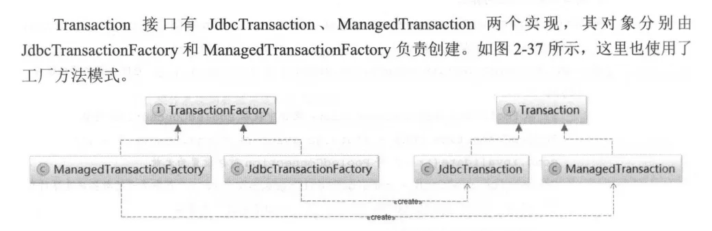

控制数据库事务



# Transaction
```java
/**
 * Wraps a database connection.
 * Handles the connection lifecycle that comprises: its creation, preparation, commit/rollback and close. 
 */
public interface Transaction {

  /**
   * Retrieve inner database connection
   */
  Connection getConnection() throws SQLException;

  /**
   * Commit inner database connection.
   */
  void commit() throws SQLException;

  /**
   * Rollback inner database connection.
   */
  void rollback() throws SQLException;

  /**
   * Close inner database connection.
   */
  void close() throws SQLException;

}

```
## JdbcTransaction
```java
public class JdbcTransaction implements Transaction {

  private static final Log log = LogFactory.getLog(JdbcTransaction.class);

  protected Connection connection; //事务对应的数据库连接
  protected DataSource dataSource; //数据库连接所属的DataSource
  protected TransactionIsolationLevel level;//事务隔离级别
  protected boolean autoCommit;//是否自动提交

  public JdbcTransaction(DataSource ds, TransactionIsolationLevel desiredLevel, boolean desiredAutoCommit) {
    dataSource = ds;
    level = desiredLevel;
    autoCommit = desiredAutoCommit;
  }

  @Override
  public Connection getConnection() throws SQLException {
    if (connection == null) {
      openConnection();
    }
    return connection;
  }

  protected void openConnection() throws SQLException {
    if (log.isDebugEnabled()) {
      log.debug("Opening JDBC Connection");
    }
    connection = dataSource.getConnection();
    if (level != null) {
      connection.setTransactionIsolation(level.getLevel());
    }
    setDesiredAutoCommit(autoCommit);
  }

  @Override
  public void commit() throws SQLException {
    if (connection != null && !connection.getAutoCommit()) {
      if (log.isDebugEnabled()) {
        log.debug("Committing JDBC Connection [" + connection + "]");
      }
      connection.commit();
    }
  }

  @Override
  public void rollback() throws SQLException {
    if (connection != null && !connection.getAutoCommit()) {
      if (log.isDebugEnabled()) {
        log.debug("Rolling back JDBC Connection [" + connection + "]");
      }
      connection.rollback();
    }
  }

  @Override
  public void close() throws SQLException {
    if (connection != null) {
      resetAutoCommit();
      if (log.isDebugEnabled()) {
        log.debug("Closing JDBC Connection [" + connection + "]");
      }
      connection.close();
    }
  }

  protected void resetAutoCommit() {
    try {
      if (!connection.getAutoCommit()) {
        // MyBatis does not call commit/rollback on a connection if just selects were performed.
        // Some databases start transactions with select statements
        // and they mandate a commit/rollback before closing the connection.
        // A workaround is setting the autocommit to true before closing the connection.
        // Sybase throws an exception here.
        if (log.isDebugEnabled()) {
          log.debug("Resetting autocommit to true on JDBC Connection [" + connection + "]");
        }
        connection.setAutoCommit(true);
      }
    } catch (SQLException e) {
      if (log.isDebugEnabled()) {
        log.debug("Error resetting autocommit to true "
            + "before closing the connection.  Cause: " + e);
      }
    }
  }

}
```
## ManagedTransaction
# TransactionFactory
```java
/**
 * Creates {@link Transaction} instances.
 */
public interface TransactionFactory {

  /**
   * Sets transaction factory custom properties.
   */
  void setProperties(Properties props);

  /**
   * Creates a {@link Transaction} out of an existing connection.
   */
  Transaction newTransaction(Connection conn);
  
  /**
   * Creates a {@link Transaction} out of a datasource.
   */
  Transaction newTransaction(DataSource dataSource, TransactionIsolationLevel level, boolean autoCommit);

}

```
## JdbcTransactionFactory
```java
public class JdbcTransactionFactory implements TransactionFactory {

  @Override
  public Transaction newTransaction(Connection conn) {
    return new JdbcTransaction(conn);
  }

  @Override
  public Transaction newTransaction(DataSource ds, TransactionIsolationLevel level, boolean autoCommit) {
    return new JdbcTransaction(ds, level, autoCommit);
  }
}
```
## ManagedTransactionFactory

> Mybatis 通常与 Spring 集成使用，数据库事务交给 Spring 进行管理 - SpringManagedTransaction


