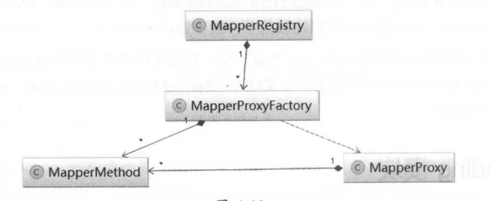

# 使用

```java
public interface SimpleMapper {

    Country selectCountry(Long id);

    List<Country> selectAll();
}
```

```java
public class Test {
    //第三种 接口方式，创建接口代理工厂类
    MapperProxyFactory<SimpleMapper> mapperProxyFactory = new MapperProxyFactory<SimpleMapper>(SimpleMapper.class);
    //创建代理接口
    SimpleMapper simpleMapper = mapperProxyFactory.newInstance(sqlSession);
    //执行方法
    Country country = simpleMapper.selectCountry(3L);
}
```

# 模块核心组件之间的关系



# 2.8.1 MapperRegistry&MapperProxyFactory

## MapperRegistry

_Mapper 接口及其对应的代理对象工厂的注册中心_

### 核心字段

```java
public class MapperRegistry {

    //Mybatis全局唯一的配置对象，其中包含了所有配置信息
    private final Configuration config;
    private final Map<Class<?>, MapperProxyFactory<?>> knownMappers = new HashMap<Class<?>, MapperProxyFactory<?>>();

    public MapperRegistry(Configuration config) {
        this.config = config;
    }

}
```

### addMapper()

```java
public class MapperRegistry {
    public <T> void addMapper(Class<T> type) {
        if (type.isInterface()) {
            if (hasMapper(type)) {
                throw new BindingException("Type " + type + " is already known to the MapperRegistry.");
            }
            boolean loadCompleted = false;
            try {
                knownMappers.put(type, new MapperProxyFactory<T>(type));
                // It's important that the type is added before the parser is run
                // otherwise the binding may automatically be attempted by the
                // mapper parser. If the type is already known, it won't try.
                MapperAnnotationBuilder parser = new MapperAnnotationBuilder(config, type);
                parser.parse();
                loadCompleted = true;
            } finally {
                if (!loadCompleted) {
                    knownMappers.remove(type);
                }
            }
        }
    }

    public void addMappers(String packageName, Class<?> superType) {
        ResolverUtil<Class<?>> resolverUtil = new ResolverUtil<Class<?>>();
        resolverUtil.find(new ResolverUtil.IsA(superType), packageName);
        Set<Class<? extends Class<?>>> mapperSet = resolverUtil.getClasses();
        for (Class<?> mapperClass : mapperSet) {
            addMapper(mapperClass);
        }
    }

    public void addMappers(String packageName) {
        addMappers(packageName, Object.class);
    }
}
```

### getMapper()

_获取Mapper接口的代理对象(通过JDK动态代理)_

```java
public class MapperRegistry {
    public <T> T getMapper(Class<T> type, SqlSession sqlSession) {
        final MapperProxyFactory<T> mapperProxyFactory = (MapperProxyFactory<T>) knownMappers.get(type);
        if (mapperProxyFactory == null) {
            throw new BindingException("Type " + type + " is not known to the MapperRegistry.");
        }
        try {
            return mapperProxyFactory.newInstance(sqlSession);
        } catch (Exception e) {
            throw new BindingException("Error getting mapper instance. Cause: " + e, e);
        }
    }
}
```

## MapperProxyFactory

_主要负责创建代理对象（MapperProxy）_

```java
public class MapperProxyFactory<T> {

    //当前MapperProxyFactory对象可以创建实现了mapperInterface接口的代理对象
    private final Class<T> mapperInterface;
    //用作缓存
    private final Map<Method, MapperMethod> methodCache = new ConcurrentHashMap<Method, MapperMethod>();

    public MapperProxyFactory(Class<T> mapperInterface) {
        this.mapperInterface = mapperInterface;
    }

    public T newInstance(SqlSession sqlSession) {
        final MapperProxy<T> mapperProxy = new MapperProxy<T>(sqlSession, mapperInterface, methodCache);
        return newInstance(mapperProxy);
    }

    @SuppressWarnings("unchecked")
    protected T newInstance(MapperProxy<T> mapperProxy) {
        return (T) Proxy.newProxyInstance(mapperInterface.getClassLoader(), new Class[]{mapperInterface}, mapperProxy);
    }

}

```
# 2.8.2 MapperProxy
```java
public class MapperProxy<T> implements InvocationHandler, Serializable {

  private static final long serialVersionUID = -6424540398559729838L;
  private final SqlSession sqlSession;
  private final Class<T> mapperInterface; //Mapper接口对应的Class对象
  //缓存MapperMethod对象，其会完成参数转换以及SQL语句的执行功能
  private final Map<Method, MapperMethod> methodCache;

  public MapperProxy(SqlSession sqlSession, Class<T> mapperInterface, Map<Method, MapperMethod> methodCache) {
    this.sqlSession = sqlSession;
    this.mapperInterface = mapperInterface;
    this.methodCache = methodCache;
  }

  @Override
  public Object invoke(Object proxy, Method method, Object[] args) throws Throwable {
    if (Object.class.equals(method.getDeclaringClass())) {
      try {
        return method.invoke(this, args);
      } catch (Throwable t) {
        throw ExceptionUtil.unwrapThrowable(t);
      }
    }
    final MapperMethod mapperMethod = cachedMapperMethod(method);
      //执行 SQL 语句
    return mapperMethod.execute(sqlSession, args);
  }


}
```

_MapperMethod缓存_
```java
public class MapperProxy<T> implements InvocationHandler, Serializable{
    private MapperMethod cachedMapperMethod(Method method) {
        MapperMethod mapperMethod = methodCache.get(method);
        if (mapperMethod == null) {
            mapperMethod = new MapperMethod(mapperInterface, method, sqlSession.getConfiguration());
            methodCache.put(method, mapperMethod);
        }
        return mapperMethod;
    }
}
```
# 2.8.3 MapperMethod
封装了 Mapper 接口中对应方法的信息，以及对应 SQL 语句的信息。

可以将 MapperMethod 看作连接 Mapper 接口以及映射配置文件中定义的 SQL 语句的桥梁。

```java
public class MapperMethod {

  private final SqlCommand command; //SQL语句的名称和类型
  private final MethodSignature method; //Mapper接口中对应方法的相关信息

  public MapperMethod(Class<?> mapperInterface, Method method, Configuration config) {
    this.command = new SqlCommand(config, mapperInterface, method);
    this.method = new MethodSignature(config, mapperInterface, method);
  }  

  public Object execute(SqlSession sqlSession, Object[] args) {
    Object result;
    switch (command.getType()) {
      case INSERT: {
    	Object param = method.convertArgsToSqlCommandParam(args);
        result = rowCountResult(sqlSession.insert(command.getName(), param));
        break;
      }
      case UPDATE: {
        Object param = method.convertArgsToSqlCommandParam(args);
        result = rowCountResult(sqlSession.update(command.getName(), param));
        break;
      }
      case DELETE: {
        Object param = method.convertArgsToSqlCommandParam(args);
        result = rowCountResult(sqlSession.delete(command.getName(), param));
        break;
      }
      case SELECT:
        if (method.returnsVoid() && method.hasResultHandler()) {
          executeWithResultHandler(sqlSession, args);
          result = null;
        } else if (method.returnsMany()) {
          result = executeForMany(sqlSession, args);
        } else if (method.returnsMap()) {
          result = executeForMap(sqlSession, args);
        } else if (method.returnsCursor()) {
          result = executeForCursor(sqlSession, args);
        } else {
          Object param = method.convertArgsToSqlCommandParam(args);
          result = sqlSession.selectOne(command.getName(), param);
        }
        break;
      case FLUSH:
        result = sqlSession.flushStatements();
        break;
      default:
        throw new BindingException("Unknown execution method for: " + command.getName());
    }
    if (result == null && method.getReturnType().isPrimitive() && !method.returnsVoid()) {
      throw new BindingException("Mapper method '" + command.getName() 
          + " attempted to return null from a method with a primitive return type (" + method.getReturnType() + ").");
    }
    return result;
  }  
}
```
## SqlCommand
```java
public static class SqlCommand {

    private final String name; //SQL语句的名称 (tk.mybatis.simple.SimpleMapper.selectCountry)
    private final SqlCommandType type; //SQL语句的类型(SELECT)

    public SqlCommand(Configuration configuration, Class<?> mapperInterface, Method method) {
      String statementName = mapperInterface.getName() + "." + method.getName();
      MappedStatement ms = null;

        //是否有该sql对应的MappedStatement
      if (configuration.hasStatement(statementName)) {
          //从 Configuration.mappedStatements 集合中查找对应的 MappedStatement 对象
        ms = configuration.getMappedStatement(statementName);
      } else if (!mapperInterface.equals(method.getDeclaringClass())) { 
        String parentStatementName = method.getDeclaringClass().getName() + "." + method.getName();
        if (configuration.hasStatement(parentStatementName)) {
          ms = configuration.getMappedStatement(parentStatementName);
        }
      }
        //处理@Flush注解
      if (ms == null) {
        if(method.getAnnotation(Flush.class) != null){
          name = null;
          type = SqlCommandType.FLUSH;
        } else {
          throw new BindingException("Invalid bound statement (not found): " + statementName);
        }
      } 
      
      else {
          //初始化name和type
        name = ms.getId();
        type = ms.getSqlCommandType();
        if (type == SqlCommandType.UNKNOWN) {
          throw new BindingException("Unknown execution method for: " + name);
        }
      }
    }
  }
```
## MethodSignature
_核心字段_
```java
public static class MethodSignature {

    private final boolean returnsMany;//返回值类型是否为Collection类型或是数组类型
    private final boolean returnsMap;//返回值类型是否为Map类型
    private final boolean returnsVoid;
    private final boolean returnsCursor;
    private final Class<?> returnType;
    private final String mapKey;
    private final Integer resultHandlerIndex;
    private final Integer rowBoundsIndex;
    private final ParamNameResolver paramNameResolver;

    public MethodSignature(Configuration configuration, Class<?> mapperInterface, Method method) {
      Type resolvedReturnType = TypeParameterResolver.resolveReturnType(method, mapperInterface);
      if (resolvedReturnType instanceof Class<?>) {
        this.returnType = (Class<?>) resolvedReturnType;
      } else if (resolvedReturnType instanceof ParameterizedType) {
        this.returnType = (Class<?>) ((ParameterizedType) resolvedReturnType).getRawType();
      } else {
        this.returnType = method.getReturnType();
      }
      this.returnsVoid = void.class.equals(this.returnType);
      this.returnsMany = (configuration.getObjectFactory().isCollection(this.returnType) || this.returnType.isArray());
      this.returnsCursor = Cursor.class.equals(this.returnType);
      this.mapKey = getMapKey(method);
      this.returnsMap = (this.mapKey != null);
      this.rowBoundsIndex = getUniqueParamIndex(method, RowBounds.class);
      this.resultHandlerIndex = getUniqueParamIndex(method, ResultHandler.class);
      this.paramNameResolver = new ParamNameResolver(configuration, method);
    }
}
```
### ParamNameResolver
_处理 Mapper 接口中定义的方法的参数列表_
```java
public class ParamNameResolver{
    public ParamNameResolver(Configuration config, Method method) {
        final Class<?>[] paramTypes = method.getParameterTypes();
        final Annotation[][] paramAnnotations = method.getParameterAnnotations();
        final SortedMap<Integer, String> map = new TreeMap<Integer, String>();
        int paramCount = paramAnnotations.length;
        // get names from @Param annotations
        for (int paramIndex = 0; paramIndex < paramCount; paramIndex++) {
            if (isSpecialParameter(paramTypes[paramIndex])) {
                // skip special parameters
                continue;
            }
            String name = null;
            for (Annotation annotation : paramAnnotations[paramIndex]) {
                if (annotation instanceof Param) {
                    hasParamAnnotation = true;
                    name = ((Param) annotation).value();
                    break;
                }
            }
            if (name == null) {
                // @Param was not specified.
                if (config.isUseActualParamName()) {
                    name = getActualParamName(method, paramIndex);
                }
                if (name == null) {
                    // use the parameter index as the name ("0", "1", ...)
                    // gcode issue #71
                    name = String.valueOf(map.size());
                }
            }
            map.put(paramIndex, name);
        }
        names = Collections.unmodifiableSortedMap(map);
    }
}
```
_names 集合的使用_
```java
public class ParamNameResolver {
    public Object getNamedParams(Object[] args) {
    final int paramCount = names.size();
    if (args == null || paramCount == 0) {
      return null;
    } else if (!hasParamAnnotation && paramCount == 1) {
      return args[names.firstKey()];
    } else {
      final Map<String, Object> param = new ParamMap<Object>();
      int i = 0;
      for (Map.Entry<Integer, String> entry : names.entrySet()) {
        param.put(entry.getValue(), args[entry.getKey()]);
        // add generic param names (param1, param2, ...)
        final String genericParamName = GENERIC_NAME_PREFIX + String.valueOf(i + 1);
        // ensure not to overwrite parameter named with @Param
        if (!names.containsValue(genericParamName)) {
          param.put(genericParamName, args[entry.getKey()]);
        }
        i++;
      }
      return param;
    }
  }
}

```


