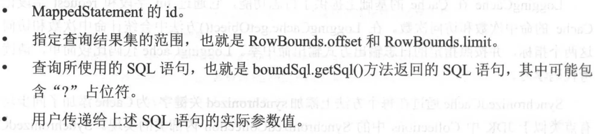

# 2.9.1 装饰器模式

# 2.9.2 Cache接口及其实现

## Cache

```java
/*
SPI for cache providers. One instance of cache will be created for each namespace. 
The cache implementation must have a constructor that receives the cache id as an String parameter. 
MyBatis will pass the namespace as id to the constructor.
   public MyCache(final String id) {
    if (id == null) {
      throw new IllegalArgumentException("Cache instances require an ID");
    }
    this.id = id;
    initialize();
   }
*/

public interface Cache {

    //The identifier of this cache
    String getId();

    void putObject(Object key, Object value);

    Object getObject(Object key);

    Object removeObject(Object key);

    void clear();

    int getSize();

    ReadWriteLock getReadWriteLock();

}
```

## PerpetualCache

_Cache 接口的基本实现_

底层使用 HashMap 记录缓存项

```java
public class PerpetualCache implements Cache {

    private String id;

    private Map<Object, Object> cache = new HashMap<Object, Object>();

    public PerpetualCache(String id) {
        this.id = id;
    }

    @Override
    public String getId() {
        return id;
    }

    @Override
    public int getSize() {
        return cache.size();
    }

    @Override
    public void putObject(Object key, Object value) {
        cache.put(key, value);
    }

    @Override
    public Object getObject(Object key) {
        return cache.get(key);
    }

    @Override
    public Object removeObject(Object key) {
        return cache.remove(key);
    }

    @Override
    public void clear() {
        cache.clear();
    }

    @Override
    public ReadWriteLock getReadWriteLock() {
        return null;
    }

    @Override
    public boolean equals(Object o) {
        if (getId() == null) {
            throw new CacheException("Cache instances require an ID.");
        }
        if (this == o) {
            return true;
        }
        if (!(o instanceof Cache)) {
            return false;
        }

        Cache otherCache = (Cache) o;
        return getId().equals(otherCache.getId());
    }

    @Override
    public int hashCode() {
        if (getId() == null) {
            throw new CacheException("Cache instances require an ID.");
        }
        return getId().hashCode();
    }

}
```

## cache.decorators

### BlockingCache

_Simple blocking decorator Simple and inefficient version of EhCache's BlockingCache decorator. It sets a lock over a
cache key when the element is not found in cache. This way, other threads will wait until this element is filled instead
of hitting the database._

```java
public class BlockingCache implements Cache {

    private long timeout;
    private final Cache delegate;
    private final ConcurrentHashMap<Object, ReentrantLock> locks;

    public BlockingCache(Cache delegate) {
        this.delegate = delegate;
        this.locks = new ConcurrentHashMap<Object, ReentrantLock>();
    }

    @Override
    public void putObject(Object key, Object value) {
        try {
            delegate.putObject(key, value);
        } finally {
            releaseLock(key);
        }
    }

    @Override
    public Object getObject(Object key) {
        acquireLock(key);
        Object value = delegate.getObject(key);
        if (value != null) {
            releaseLock(key);
        }
        return value;
    }

    @Override
    public Object removeObject(Object key) {
        // despite of its name, this method is called only to release locks
        releaseLock(key);
        return null;
    }

    private ReentrantLock getLockForKey(Object key) {
        ReentrantLock lock = new ReentrantLock();
        ReentrantLock previous = locks.putIfAbsent(key, lock);
        return previous == null ? lock : previous;
    }

    private void acquireLock(Object key) {
        Lock lock = getLockForKey(key);
        if (timeout > 0) {
            try {
                boolean acquired = lock.tryLock(timeout, TimeUnit.MILLISECONDS);
                if (!acquired) {
                    throw new CacheException("Couldn't get a lock in " + timeout + " for the key " + key + " at the cache " + delegate.getId());
                }
            } catch (InterruptedException e) {
                throw new CacheException("Got interrupted while trying to acquire lock for key " + key, e);
            }
        } else {
            lock.lock();
        }
    }

    private void releaseLock(Object key) {
        ReentrantLock lock = locks.get(key);
        if (lock.isHeldByCurrentThread()) {
            lock.unlock();
        }
    }

    @Override
    public String getId() {
        return delegate.getId();
    }

    @Override
    public int getSize() {
        return delegate.getSize();
    }

    @Override
    public void clear() {
        delegate.clear();
    }
}
```

### FifoCache

_FIFO (first in, first out) cache decorator_

```java
public class FifoCache implements Cache {

    private final Cache delegate;
    private Deque<Object> keyList;
    private int size;

    public FifoCache(Cache delegate) {
        this.delegate = delegate;
        this.keyList = new LinkedList<Object>();
        this.size = 1024;
    }

    @Override
    public void putObject(Object key, Object value) {
        cycleKeyList(key);//检测并清理缓存
        delegate.putObject(key, value);//添加缓存项
    }

    private void cycleKeyList(Object key) {
        //Appends the specified element to the end of this list.
        keyList.addLast(key);
        //如果达到缓存上限，则清理最老的缓存项
        if (keyList.size() > size) {
            //Removes and returns the first element from this list.
            Object oldestKey = keyList.removeFirst();
            delegate.removeObject(oldestKey);
        }
    }

    @Override
    public void clear() {
        delegate.clear();
        keyList.clear();
    }

}
```

### LruCache

_Lru (least recently used) cache decorator_

```java
public class LruCache implements Cache {

    private final Cache delegate;
    private Map<Object, Object> keyMap; //记录key最近的使用情况
    private Object eldestKey; //记录最少被使用的缓存项的key

    public LruCache(Cache delegate) {
        this.delegate = delegate;
        setSize(1024);
    }

    public void setSize(final int size) {
        //true表示LinkedHashMap.get()方法会改变其记录的顺序
        keyMap = new LinkedHashMap<Object, Object>(size, .75F, true) {
            private static final long serialVersionUID = 4267176411845948333L;

            @Override
            protected boolean removeEldestEntry(Map.Entry<Object, Object> eldest) {
                boolean tooBig = size() > size;
                if (tooBig) {
                    eldestKey = eldest.getKey();
                }
                return tooBig;
            }
        };
    }

    @Override
    public void putObject(Object key, Object value) {
        delegate.putObject(key, value);
        cycleKeyList(key);
    }

    @Override
    public Object getObject(Object key) {
        keyMap.get(key); //touch
        return delegate.getObject(key);
    }

    @Override
    public Object removeObject(Object key) {
        return delegate.removeObject(key);
    }

    @Override
    public void clear() {
        delegate.clear();
        keyMap.clear();
    }

    private void cycleKeyList(Object key) {
        keyMap.put(key, key);
        if (eldestKey != null) {
            delegate.removeObject(eldestKey);
            eldestKey = null;
        }
    }

    @Override
    public String getId() {
        return delegate.getId();
    }

    @Override
    public int getSize() {
        return delegate.getSize();
    }
}
```

### SoftCache&WeakCache

#### 四种引用类型

##### 强引用


##### 软引用


##### 引用队列


##### 弱引用


##### 幽灵引用（虚引用）

#### softCache

_Soft Reference cache decorator_

```java
public class SoftCache implements Cache {
    //SoftCache中，最近使用的一部分缓存项不会被GC回收，是通过将其value添加到hardLinksToAvoidGarbageCollection
    //集合中实现的（有强引用指向其value）
    private final Deque<Object> hardLinksToAvoidGarbageCollection;
    //引用队列，记录已经被GC回收的缓存项所对应的SoftEntry对象
    private final ReferenceQueue<Object> queueOfGarbageCollectedEntries;
    private final Cache delegate;
    private int numberOfHardLinks;//强连接个数

    public SoftCache(Cache delegate) {
        this.delegate = delegate;
        this.numberOfHardLinks = 256;
        this.hardLinksToAvoidGarbageCollection = new LinkedList<>();
        this.queueOfGarbageCollectedEntries = new ReferenceQueue<>();
    }

    @Override
    public Object removeObject(Object key) {
        removeGarbageCollectedItems();
        return delegate.removeObject(key);
    }

    @Override
    public void clear() {
        synchronized (hardLinksToAvoidGarbageCollection) {
            hardLinksToAvoidGarbageCollection.clear();
        }
        removeGarbageCollectedItems();
        delegate.clear();
    }

    @Override
    public String getId() {
        return delegate.getId();
    }

    @Override
    public int getSize() {
        removeGarbageCollectedItems();
        return delegate.getSize();
    }

    public void setSize(int size) {
        this.numberOfHardLinks = size;
    }

}
```

##### SoftEntry

_指向 key 的引用是强引用，指向 value 的引用是软引用_

```java
private static class SoftEntry extends SoftReference<Object> {
    private final Object key;

    SoftEntry(Object key, Object value, ReferenceQueue<Object> garbageCollectionQueue) {
        super(value, garbageCollectionQueue);//指向 value 的引用是软引用,且关联了引用队列
        this.key = key;
    }
}
```

##### putObject()

```java
public class SoftCache implements Cache {
    @Override
    public void putObject(Object key, Object value) {
        removeGarbageCollectedItems(); //清楚已经被GC回收的缓存项
        //向缓存中添加缓存项
        delegate.putObject(key, new SoftEntry(key, value, queueOfGarbageCollectedEntries));
    }


    private void removeGarbageCollectedItems() {
        SoftEntry sv;
        while ((sv = (SoftEntry) queueOfGarbageCollectedEntries.poll()) != null) {
            delegate.removeObject(sv.key); //将已经被GC回收的value对象对应的缓存项清除
        }
    }

}
```

##### getObject()

```java
public class SoftCache implements Cache {
    @Override
    public Object getObject(Object key) {
        Object result = null;
        @SuppressWarnings("unchecked") // assumed delegate cache is totally managed by this cache
        SoftReference<Object> softReference = (SoftReference<Object>) delegate.getObject(key);
        if (softReference != null) {
            result = softReference.get();
            if (result == null) {//已经被GC回收
                delegate.removeObject(key);//从缓存中清除对应的缓存项
            } else {//未被GC回收
                // See #586 (and #335) modifications need more than a read lock
                synchronized (hardLinksToAvoidGarbageCollection) {
                    hardLinksToAvoidGarbageCollection.addFirst(result);
                    if (hardLinksToAvoidGarbageCollection.size() > numberOfHardLinks) {
                        hardLinksToAvoidGarbageCollection.removeLast();
                    }
                }
            }
        }
        return result;
    }
}
```

### ScheduledCache

_周期性清理缓存的装饰器。ScheduledCache 的 getObject()/putObject()/removeObject()等方法执行时，会根据lastClear，clearInterval 决定是否需要进行清理工作_

```java
public class ScheduledCache implements Cache {

    private Cache delegate;
    protected long clearInterval;
    protected long lastClear;

    public ScheduledCache(Cache delegate) {
        this.delegate = delegate;
        this.clearInterval = 60 * 60 * 1000; // 1 hour
        this.lastClear = System.currentTimeMillis();
    }

    @Override
    public String getId() {
        return delegate.getId();
    }

    @Override
    public int getSize() {
        clearWhenStale();
        return delegate.getSize();
    }

    @Override
    public void putObject(Object key, Object object) {
        clearWhenStale();
        delegate.putObject(key, object);
    }

    @Override
    public Object getObject(Object key) {
        return clearWhenStale() ? null : delegate.getObject(key);
    }

    @Override
    public Object removeObject(Object key) {
        clearWhenStale();
        return delegate.removeObject(key);
    }

    @Override
    public void clear() {
        lastClear = System.currentTimeMillis();
        delegate.clear();
    }

    private boolean clearWhenStale() {
        if (System.currentTimeMillis() - lastClear > clearInterval) {
            clear();
            return true;
        }
        return false;
    }

}

```

### LoggingCache

```java
public class LoggingCache implements Cache {

    private Log log;
    private Cache delegate;
    protected int requests = 0;//访问次数
    protected int hits = 0;//命中次数

    public LoggingCache(Cache delegate) {
        this.delegate = delegate;
        this.log = LogFactory.getLog(getId());
    }

    @Override
    public Object getObject(Object key) {
        requests++;
        final Object value = delegate.getObject(key);
        if (value != null) {
            hits++;
        }
        if (log.isDebugEnabled()) {
            log.debug("Cache Hit Ratio [" + getId() + "]: " + getHitRatio());
        }
        return value;
    }

    private double getHitRatio() {
        return (double) hits / (double) requests;
    }

}
```

### SynchronizedCache

```java
public class SynchronizedCache implements Cache {

    private Cache delegate;

    public SynchronizedCache(Cache delegate) {
        this.delegate = delegate;
    }

    @Override
    public synchronized int getSize() {
        return delegate.getSize();
    }

    @Override
    public synchronized void putObject(Object key, Object object) {
        delegate.putObject(key, object);
    }

    @Override
    public synchronized Object getObject(Object key) {
        return delegate.getObject(key);
    }

    @Override
    public synchronized Object removeObject(Object key) {
        return delegate.removeObject(key);
    }

    @Override
    public synchronized void clear() {
        delegate.clear();
    }
}
```

### SerializedCache


```java
public class SerializedCache implements Cache {

    private Cache delegate;

    public SerializedCache(Cache delegate) {
        this.delegate = delegate;
    }

    @Override
    public void putObject(Object key, Object object) {
        if (object == null || object instanceof Serializable) {
            delegate.putObject(key, serialize((Serializable) object));
        } else {
            throw new CacheException("SharedCache failed to make a copy of a non-serializable object: " + object);
        }
    }

    @Override
    public Object getObject(Object key) {
        Object object = delegate.getObject(key);
        return object == null ? null : deserialize((byte[]) object);
    }

    private byte[] serialize(Serializable value) {
        try {
            ByteArrayOutputStream bos = new ByteArrayOutputStream();
            ObjectOutputStream oos = new ObjectOutputStream(bos);
            oos.writeObject(value);
            oos.flush();
            oos.close();
            return bos.toByteArray();
        } catch (Exception e) {
            throw new CacheException("Error serializing object.  Cause: " + e, e);
        }
    }

    private Serializable deserialize(byte[] value) {
        Serializable result;
        try {
            ByteArrayInputStream bis = new ByteArrayInputStream(value);
            ObjectInputStream ois = new CustomObjectInputStream(bis);
            result = (Serializable) ois.readObject();
            ois.close();
        } catch (Exception e) {
            throw new CacheException("Error deserializing object.  Cause: " + e, e);
        }
        return result;
    }

    public static class CustomObjectInputStream extends ObjectInputStream {

        public CustomObjectInputStream(InputStream in) throws IOException {
            super(in);
        }

        @Override
        protected Class<?> resolveClass(ObjectStreamClass desc) throws IOException, ClassNotFoundException {
            return Resources.classForName(desc.getName());
        }

    }

}
```

# 2.9.3 CacheKey

在 Cache 中唯一确定一个缓存项需要使用缓存项的 key, MyBatis 中因为涉及动态 SQL 等多方面因素，其缓存项的 key 不能仅仅通过一个 String 表示。

所以 MyBatis 使用 CacheKey 类来表示缓存项的 key。一个 CacheKey 对象中可以封装多个影响缓存项的因素

CacheKey 中可以添加多个对象，由这些对象共同确定两个 CacheKey 对象是否相同。

## 核心字段

```java
public class CacheKey implements Cloneable, Serializable {
    private static final int DEFAULT_MULTIPLYER = 37;
    private static final int DEFAULT_HASHCODE = 17;

    private int multiplier;//参与计算 hashcode ，默认位是 37
    private int hashcode;//CacheKey 对象的 hashcode ，初始位是 17
    private long checksum;//校验和
    private int count;//updateList 集合的个数
    private List<Object> updateList;//／由该集合中的所有对象共同决定两个 CacheKey 是否相同
}

```

## 构成



## 添加对象

```java
public class CacheKey implements Cloneable, Serializable {
    public void update(Object object) {
        if (object != null && object.getClass().isArray()) { //添加数组或集合类型
            int length = Array.getLength(object);
            for (int i = 0; i < length; i++) {
                Object element = Array.get(object, i);
                doUpdate(element);
            }
        } else {
            doUpdate(object);
        }
    }

    private void doUpdate(Object object) {
        int baseHashCode = object == null ? 1 : object.hashCode();

        count++;
        checksum += baseHashCode;
        baseHashCode *= count;

        hashcode = multiplier * hashcode + baseHashCode;

        updateList.add(object);
    }
}
```

## 比较 Cachekey 对象是否相同

```java
public class CacheKey implements Cloneable, Serializable {
    @Override
    public boolean equals(Object object) {
        if (this == object) {
            return true;
        }
        if (!(object instanceof CacheKey)) {
            return false;
        }

        final CacheKey cacheKey = (CacheKey) object;

        if (hashcode != cacheKey.hashcode) {
            return false;
        }
        if (checksum != cacheKey.checksum) {
            return false;
        }
        if (count != cacheKey.count) {
            return false;
        }

        for (int i = 0; i < updateList.size(); i++) {
            Object thisObject = updateList.get(i);
            Object thatObject = cacheKey.updateList.get(i);
            if (thisObject == null) {
                if (thatObject != null) {
                    return false;
                }
            } else {
                if (!thisObject.equals(thatObject)) {
                    return false;
                }
            }
        }
        return true;
    }

    @Override
    public int hashCode() {
        return hashcode;
    }
}
```

