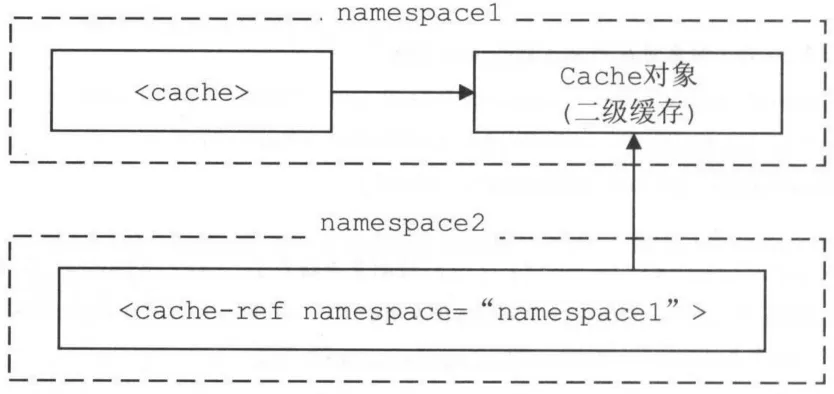

# 3.1.1 建造者模式

# 3.1.2 BaseBuilder

MyBatis 初始化的主要工作是加载并解析 mybatis-config.xml 配置文件、映射配置文件以及相关的注解信息。

## MyBatis 的初始化入口：

```java
public class SqlSessionFactoryBuilder {
    public SqlSessionFactory build(Reader reader, String environment, Properties properties) {
        try {
            //读取配置文件
            XMLConfigBuilder parser =
                    new XMLConfigBuilder(reader, environment, properties);
            //解析配置文件得到 Configuration 对象，创建 DefaultSqlSessionFactory 对象
            return build(parser.parse());
        } catch (Exception e) {
            throw ExceptionFactory.wrapException("Error building SqlSession.", e);
        } finally {
            ErrorContext.instance().reset();
            try {
                reader.close();
            } catch (IOException e) {
                // Intentionally ignore. Prefer previous error.
            }
        }
    }
}

```

```java
public class XMLConfigBuilder extends BaseBuilder {
    public XMLConfigBuilder(InputStream inputStream, String environment, Properties props) {
        this(new XPathParser(inputStream, true, props, new XMLMapperEntityResolver()), environment, props);
    }

    private XMLConfigBuilder(XPathParser parser, String environment, Properties props) {
        super(new Configuration());
        ErrorContext.instance().resource("SQL Mapper Configuration");
        this.configuration.setVariables(props);
        this.parsed = false;
        this.environment = environment;
        this.parser = parser;
    }
}
```

## 核心字段

```java
public abstract class BaseBuilder {
    //存储MyBatis中几乎全部配置信息
    protected final Configuration configuration;
    //在mybatis-config.xml中<typeAliases>标签定义别名
    protected final TypeAliasRegistry typeAliasRegistry;
    //在mybatis-config.xml中<typeHandlers>添加，完成指定数据库类型与Java类型的转换
    protected final TypeHandlerRegistry typeHandlerRegistry;

    public BaseBuilder(Configuration configuration) {
        this.configuration = configuration;
        this.typeAliasRegistry = this.configuration.getTypeAliasRegistry();
        this.typeHandlerRegistry = this.configuration.getTypeHandlerRegistry();
    }
}

```

## 对 Alias 和 typeHandler 的处理

_BaseBuilder 依赖typeAliasRegistry、typeHandlerRegistry 实现对 Alias 和 typeHandler 的处理_

```java
public abstract class BaseBuilder {

    protected Class<?> resolveAlias(String alias) {
        return typeAliasRegistry.resolveAlias(alias);
    }

    protected TypeHandler<?> resolveTypeHandler(Class<?> javaType, Class<? extends TypeHandler<?>> typeHandlerType) {
        if (typeHandlerType == null) {
            return null;
        }
        // javaType ignored for injected handlers see issue #746 for full detail
        TypeHandler<?> handler = typeHandlerRegistry.getMappingTypeHandler(typeHandlerType);
        if (handler == null) {
            // not in registry, create a new one
            handler = typeHandlerRegistry.getInstance(javaType, typeHandlerType);
        }
        return handler;
    }
}

```

## 转换为枚举类型

Mybatis 中使用 ResultSetType枚举类型-结果集类型，ParameterMode 枚举类型表示存储过程中的参数类型。

BaseBuilder 提供相应方法将 String 转换为对应的枚举对象

### ResultSetType

```java
public abstract class BaseBuilder {
    protected ResultSetType resolveResultSetType(String alias) {
        if (alias == null) {
            return null;
        }
        try {
            return ResultSetType.valueOf(alias);
        } catch (IllegalArgumentException e) {
            throw new BuilderException("Error resolving ResultSetType. Cause: " + e, e);
        }
    }


}
```

```java
public enum ResultSetType {
    DEFAULT(-1),
    FORWARD_ONLY(1003),
    SCROLL_INSENSITIVE(1004),
    SCROLL_SENSITIVE(1005);

    private final int value;

    private ResultSetType(int value) {
        this.value = value;
    }

    public int getValue() {
        return this.value;
    }
}
```

### ParameterMode

```java
public abstract class BaseBuilder {
    protected ParameterMode resolveParameterMode(String alias) {
        if (alias == null) {
            return null;
        }
        try {
            return ParameterMode.valueOf(alias);
        } catch (IllegalArgumentException e) {
            throw new BuilderException("Error resolving ParameterMode. Cause: " + e, e);
        }
    }
}
```

```java
public enum ParameterMode {
    IN, OUT, INOUT
}
```

# 3.1.3 XMLConfigBuilder

负责解析 mybatis-config.xml 配置文件

## 核心字段

```java
public class XMLConfigBuilder extends BaseBuilder {
    //标识是否已经解析 mybatis-config.xml 配置文件
    private boolean parsed;
    //用于解析 mybatis-config.xml 配置文件的 XPathParser 对象
    private XPathParser parser;
    //标识＜environment＞配置的名称，默认读取＜environment> 标签的 default 属性
    private String environment;
    //ReflectorFactory 负责创建和缓存 Reflector 对象，
    private ReflectorFactory localReflectorFactory = new DefaultReflectorFactory();
}

```

### DefaultReflectorFactory

_负责创建和缓存 Reflector 对象_

```java
public class DefaultReflectorFactory implements ReflectorFactory {
    private boolean classCacheEnabled = true;
    private final ConcurrentMap<Class<?>, Reflector> reflectorMap = new ConcurrentHashMap<Class<?>, Reflector>();

    public DefaultReflectorFactory() {
    }

    @Override
    public boolean isClassCacheEnabled() {
        return classCacheEnabled;
    }

    @Override
    public void setClassCacheEnabled(boolean classCacheEnabled) {
        this.classCacheEnabled = classCacheEnabled;
    }

    @Override
    public Reflector findForClass(Class<?> type) {
        if (classCacheEnabled) {
            // synchronized (type) removed see issue #461
            Reflector cached = reflectorMap.get(type);
            if (cached == null) {
                cached = new Reflector(type);
                reflectorMap.put(type, cached);
            }
            return cached;
        } else {
            return new Reflector(type);
        }
    }

}
```

## 解析各个节点

```java
public class XMLConfigBuilder extends BaseBuilder {
    public Configuration parse() {
        if (parsed) {
            throw new BuilderException("Each XMLConfigBuilder can only be used once.");
        }
        parsed = true;
        parseConfiguration(parser.evalNode("/configuration"));
        return configuration;
    }
}

```

```java
public class XMLConfigBuilder extends BaseBuilder {
    private void parseConfiguration(XNode root) {
        try {
            propertiesElement(root.evalNode("properties"));
            typeAliasesElement(root.evalNode("typeAliases"));
            pluginElement(root.evalNode("plugins"));
            objectFactoryElement(root.evalNode("objectFactory"));
            objectWrapperFactoryElement(root.evalNode("objectWrapperFactory"));
            reflectionFactoryElement(root.evalNode("reflectionFactory"));
            settingsElement(root.evalNode("settings"));
            // read it after objectFactory and objectWrapperFactory issue #631
            environmentsElement(root.evalNode("environments"));
            databaseIdProviderElement(root.evalNode("databaseIdProvider"));
            typeHandlerElement(root.evalNode("typeHandlers"));
            mapperElement(root.evalNode("mappers"));
        } catch (Exception e) {
            throw new BuilderException("Error parsing SQL Mapper Configuration. Cause: " + e, e);
        }
    }
}
```

# 3.1.4 XMLMapperBuilder

_parse()方法是解析映射文件的入口_

## 解析映射文件入口

```java
public class XMLMapperBuilder extends BaseBuilder {
    public void parse() {
        if (!configuration.isResourceLoaded(resource)) {
            configurationElement(parser.evalNode("/mapper"));
            //记录已经加载过的映射文件
            configuration.addLoadedResource(resource);
            bindMapperForNamespace();//注册Mapper接口
        }
        //处理configurationElement() 方法中解析失败的<resultMap>节点
        parsePendingResultMaps();
        //处理configurationElement() 方法中解析失败的<cache-ref>节点
        parsePendingChacheRefs();
        //处理configurationElement() 方法中解析失败的SQL节点
        parsePendingStatements();
    }
}
```

## configurationElement()

```java
public class XMLMapperBuilder extends BaseBuilder {
    private void configurationElement(XNode context) {
        try {
            //获取<mapper>节点中的namespace属性
            String namespace = context.getStringAttribute("namespace");
            if (namespace == null || namespace.equals("")) {
                throw new BuilderException("Mapper's namespace cannot be empty");
            }
            builderAssistant.setCurrentNamespace(namespace);
            cacheRefElement(context.evalNode("cache-ref"));
            cacheElement(context.evalNode("cache"));
            parameterMapElement(context.evalNodes("/mapper/parameterMap"));
            resultMapElements(context.evalNodes("/mapper/resultMap"));
            sqlElement(context.evalNodes("/mapper/sql"));
            buildStatementFromContext(context.evalNodes("select|insert|update|delete"));
        } catch (Exception e) {
            throw new BuilderException("Error parsing Mapper XML. Cause: " + e, e);
        }
    }
}
```

### 解析 cache 节点

```java
public class XMLMapperBuilder extends BaseBuilder {
    private void cacheElement(XNode context) throws Exception {
        if (context != null) {
            String type = context.getStringAttribute("type", "PERPETUAL");
            Class<? extends Cache> typeClass = typeAliasRegistry.resolveAlias(type);
            String eviction = context.getStringAttribute("eviction", "LRU");
            Class<? extends Cache> evictionClass = typeAliasRegistry.resolveAlias(eviction);
            Long flushInterval = context.getLongAttribute("flushInterval");
            Integer size = context.getIntAttribute("size");
            boolean readWrite = !context.getBooleanAttribute("readOnly", false);
            boolean blocking = context.getBooleanAttribute("blocking", false);
            Properties props = context.getChildrenAsProperties();
            builderAssistant.useNewCache(typeClass, evictionClass, flushInterval, size, readWrite, blocking, props);
        }
    }
}
```

#### useNewCache

创建`Cache` 对象

```java
public class MapperBuilderAssistant extends BaseBuilder {
    public Cache useNewCache(Class<? extends Cache> typeClass,
                             Class<? extends Cache> evictionClass,
                             Long flushInterval,
                             Integer size,
                             boolean readWrite,
                             boolean blocking,
                             Properties props) {
        typeClass = valueOrDefault(typeClass, PerpetualCache.class);
        evictionClass = valueOrDefault(evictionClass, LruCache.class);
        Cache cache = new CacheBuilder(currentNamespace)
                .implementation(typeClass)
                .addDecorator(evictionClass)
                .clearInterval(flushInterval)
                .size(size)
                .readWrite(readWrite)
                .blocking(blocking)
                .properties(props)
                .build();
        configuration.addCache(cache);
        currentCache = cache;
        return cache;
    }

    private <T> T valueOrDefault(T value, T defaultValue) {
        return value == null ? defaultValue : value;
    }
}
```

##### CacheBuilder

```java
public class CacheBuilder {
    private String id;
    private Class<? extends Cache> implementation;
    private List<Class<? extends Cache>> decorators;
    private Integer size;
    private Long clearInterval;
    private boolean readWrite;
    private Properties properties;
    private boolean blocking;

    public CacheBuilder(String id) {
        this.id = id;
        this.decorators = new ArrayList<Class<? extends Cache>>();
    }

    public Cache build() {
        setDefaultImplementations();
        Cache cache = newBaseCacheInstance(implementation, id);
        setCacheProperties(cache);

        if (PerpetualCache.class.equals(cache.getClass())) {
            for (Class<? extends Cache> decorator : decorators) {
                cache = newCacheDecoratorInstance(decorator, cache);
                setCacheProperties(cache);
            }
            cache = setStandardDecorators(cache);
        } else if (!LoggingCache.class.isAssignableFrom(cache.getClass())) {
            cache = new LoggingCache(cache);
        }
        return cache;
    }

    private void setDefaultImplementations() {
        if (implementation == null) {
            implementation = PerpetualCache.class;
            if (decorators.isEmpty()) {
                decorators.add(LruCache.class);
            }
        }
    }

    //装饰器模式根据配置不停装饰
    private Cache setStandardDecorators(Cache cache) {
        try {
            MetaObject metaCache = SystemMetaObject.forObject(cache);
            if (size != null && metaCache.hasSetter("size")) {
                metaCache.setValue("size", size);
            }
            if (clearInterval != null) {
                cache = new ScheduledCache(cache);
                ((ScheduledCache) cache).setClearInterval(clearInterval);
            }
            if (readWrite) {
                cache = new SerializedCache(cache);
            }
            cache = new LoggingCache(cache);
            cache = new SynchronizedCache(cache);
            if (blocking) {
                cache = new BlockingCache(cache);
            }
            return cache;
        } catch (Exception e) {
            throw new CacheException("Error building standard cache decorators.  Cause: " + e, e);
        }
    }

    private Cache newBaseCacheInstance(Class<? extends Cache> cacheClass, String id) {
        Constructor<? extends Cache> cacheConstructor = getBaseCacheConstructor(cacheClass);
        try {
            return cacheConstructor.newInstance(id);
        } catch (Exception e) {
            throw new CacheException("Could not instantiate cache implementation (" + cacheClass + "). Cause: " + e, e);
        }
    }

    private Constructor<? extends Cache> getBaseCacheConstructor(Class<? extends Cache> cacheClass) {
        try {
            return cacheClass.getConstructor(String.class);
        } catch (Exception e) {
            throw new CacheException("Invalid base cache implementation (" + cacheClass + ").  " +
                    "Base cache implementations must have a constructor that takes a String id as a parameter.  Cause: " + e, e);
        }
    }

    private Cache newCacheDecoratorInstance(Class<? extends Cache> cacheClass, Cache base) {
        Constructor<? extends Cache> cacheConstructor = getCacheDecoratorConstructor(cacheClass);
        try {
            return cacheConstructor.newInstance(base);
        } catch (Exception e) {
            throw new CacheException("Could not instantiate cache decorator (" + cacheClass + "). Cause: " + e, e);
        }
    }

    private Constructor<? extends Cache> getCacheDecoratorConstructor(Class<? extends Cache> cacheClass) {
        try {
            return cacheClass.getConstructor(Cache.class);
        } catch (Exception e) {
            throw new CacheException("Invalid cache decorator (" + cacheClass + ").  " +
                    "Cache decorators must have a constructor that takes a Cache instance as a parameter.  Cause: " + e, e);
        }
    }
}

```

##### configuration.addCache(cache)

```java
public class Configuration {

    protected final Map<String, Cache> caches = new StrictMap<Cache>("Caches collection");

    public void addCache(Cache cache) {
        caches.put(cache.getId(), cache);
    }
}


```

将 `Cache` 对象添加到 `configuration` 中的 `StrictMap` 中。

###### StrictMap

```java
protected static class StrictMap<V> extends HashMap<String, V> {

    private static final long serialVersionUID = -4950446264854982944L;
    private String name;

    public V put(String key, V value) {
        if (containsKey(key)) {
            throw new IllegalArgumentException(name + " already contains value for " + key);
        }
        if (key.contains(".")) {
            //按照"."将key分为数组，并将数组的最后一项作为shortkey
            final String shortKey = getShortName(key);
            if (super.get(shortKey) == null) {
                super.put(shortKey, value);
            } else {
                super.put(shortKey, (V) new Ambiguity(shortKey));
            }
        }
        return super.put(key, value);
    }

    public V get(Object key) {
        V value = super.get(key);
        if (value == null) {
            throw new IllegalArgumentException(name + " does not contain value for " + key);
        }
        if (value instanceof Ambiguity) {
            throw new IllegalArgumentException(((Ambiguity) value).getSubject() + " is ambiguous in " + name
                    + " (try using the full name including the namespace, or rename one of the entries)");
        }
        return value;
    }

    //Ambiguity 表示存在二义性的键值对。
    protected static class Ambiguity {
        private String subject;

        public Ambiguity(String subject) {
            this.subject = subject;
        }

        public String getSubject() {
            return subject;
        }
    }

}
```

### 2.解析<cache-ref>节点

`XMLMapperBuilder.cacheElement()`方法为每个 `namespace` 创建一个对应的 `Cache` 对象，并在 Configuration.caches 集合中记录 namespace 与 Cache
对象之间的对应关系。

可通过`<cache-ref>`节点进行配置，让多个 `namespace` 共用同一个二级缓存，即同一个 `Cache` 对象



```xml

<cache-ref namespace="tk.mybatis.simple.mapper.RoleMapper"/>
```

```java
public class XMLMapperBuilder extends BaseBuilder {
    private void cacheRefElement(XNode context) {
        if (context != null) {
            configuration.addCacheRef(builderAssistant.getCurrentNamespace(), context.getStringAttribute("namespace"));
            CacheRefResolver cacheRefResolver = new CacheRefResolver(builderAssistant, context.getStringAttribute("namespace"));
            try {
                cacheRefResolver.resolveCacheRef();
            } catch (IncompleteElementException e) {
                configuration.addIncompleteCacheRef(cacheRefResolver);
            }
        }
    }
}
```

- 保存在 Configuration 中

```java
public class Configuration {
    /*
     * A map holds cache-ref relationship. The key is the namespace that
     * references a cache bound to another namespace and the value is the
     * namespace which the actual cache is bound to.
     */
    protected final Map<String, String> cacheRefMap = new HashMap<String, String>();

    public void addCacheRef(String namespace, String referencedNamespace) {
        cacheRefMap.put(namespace, referencedNamespace);
    }

}
```

- 用引用的二级缓存处理

```java
public class CacheRefResolver {
    private final MapperBuilderAssistant assistant;
    private final String cacheRefNamespace;

    public CacheRefResolver(MapperBuilderAssistant assistant, String cacheRefNamespace) {
        this.assistant = assistant;
        this.cacheRefNamespace = cacheRefNamespace;
    }

    public Cache resolveCacheRef() {
        return assistant.useCacheRef(cacheRefNamespace);
    }
}
```

```java
public class MapperBuilderAssistant extends BaseBuilder {
    public Cache useCacheRef(String namespace) {
        if (namespace == null) {
            throw new BuilderException("cache-ref element requires a namespace attribute.");
        }
        try {
            unresolvedCacheRef = true;
            Cache cache = configuration.getCache(namespace);
            if (cache == null) {
                throw new IncompleteElementException("No cache for namespace '" + namespace + "' could be found.");
            }
            currentCache = cache;
            unresolvedCacheRef = false;
            return cache;
        } catch (IllegalArgumentException e) {
            throw new IncompleteElementException("No cache for namespace '" + namespace + "' could be found.", e);
        }
    }
}
```

### 4.解析<resultMap>节点

### 5.解析<sql>节点

```java
public class XMLMapperBuilder extends BaseBuilder {
    private void sqlElement(List<XNode> list, String requiredDatabaseId) throws Exception {

        //遍历<sql>节点
        for (XNode context : list) {
            String databaseId = context.getStringAttribute("databaseId");
            String id = context.getStringAttribute("id");
            id = builderAssistant.applyCurrentNamespace(id, false);//为id添加命名空间
            if (databaseIdMatchesCurrent(id, databaseId, requiredDatabaseId)) {
                sqlFragments.put(id, context);
            }
        }
    }
}
```

# 3.1.5 XMLStatementBuilder

## 1.解析<include>节点

## 2.解析<selectKey>节点

## 3.解析 SQL 节点

# 3.1.6 绑定 Mapper 接口

每个映射配置文件的命名空间可以绑定一个 `Mapper` 接口，并注册到 `MapperRegistry` 中

进行映射配置文件与对应 `Mapper` 接口的绑定

```java
public class XMLMapperBuilder extends BaseBuilder {

    private void bindMapperForNamespace() {
        //映射配置文件的命令空间，如：<mapper namespace="tk.mybatis.simple.mapper.CountryMapper">
        String namespace = builderAssistant.getCurrentNamespace();
        if (namespace != null) {
            Class<?> boundType = null;
            try {
                boundType = Resources.classForName(namespace);
            } catch (ClassNotFoundException e) {
                //ignore, bound type is not required
            }
            if (boundType != null) {
                if (!configuration.hasMapper(boundType)) {
                    // Spring may not know the real resource name so we set a flag
                    // to prevent loading again this resource from the mapper interface
                    // look at MapperAnnotationBuilder#loadXmlResource
                    configuration.addLoadedResource("namespace:" + namespace);
                    configuration.addMapper(boundType);
                }
            }
        }
    }
}
```

```java
public class Configuration {
    public <T> void addMapper(Class<T> type) {
        mapperRegistry.addMapper(type);
    }
}
```

```java
public class MapperRegistry {
    public <T> void addMapper(Class<T> type) {
        if (type.isInterface()) {
            if (hasMapper(type)) {
                throw new BindingException("Type " + type + " is already known to the MapperRegistry.");
            }
            boolean loadCompleted = false;
            try {
                knownMappers.put(type, new MapperProxyFactory<T>(type));
                // It's important that the type is added before the parser is run
                // otherwise the binding may automatically be attempted by the
                // mapper parser. If the type is already known, it won't try.
                MapperAnnotationBuilder parser = new MapperAnnotationBuilder(config, type);
                parser.parse();
                loadCompleted = true;
            } finally {
                if (!loadCompleted) {
                    knownMappers.remove(type);
                }
            }
        }
    }
}
```

`MapperAnnotationBuilder.parse()` 解析 `Mapper` 接口中的注解信息

```java
public class MapperAnnotationBuilder {
    public void parse() {
        String resource = type.toString();
        if (!configuration.isResourceLoaded(resource)) {
            //创建 XMLMapperBuilder 对象解析对应的映射文件
            loadXmlResource();
            configuration.addLoadedResource(resource);
            assistant.setCurrentNamespace(type.getName());
            parseCache(); //解析@CacheNamespace注解
            parseCacheRef();//解析@CacheNamespaceRef注解
            Method[] methods = type.getMethods();
            for (Method method : methods) {
                try {
                    if (!method.isBridge()) {
                        //解析＠SelectKey 、@ResultMap 等注解，并创 MappedStatement 对象
                        parseStatement(method);
                    }
                } catch (IncompleteElementException e) {
                    configuration.addIncompleteMethod(new MethodResolver(this, method));
                }
            }
        }
        parsePendingMethods();
    }
}
```

# 3.1.7 处理 incomplete* 集合


