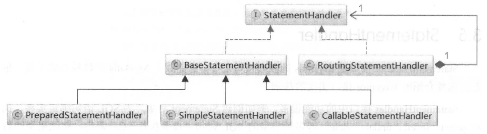
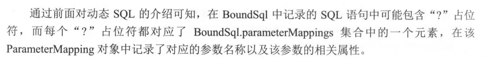
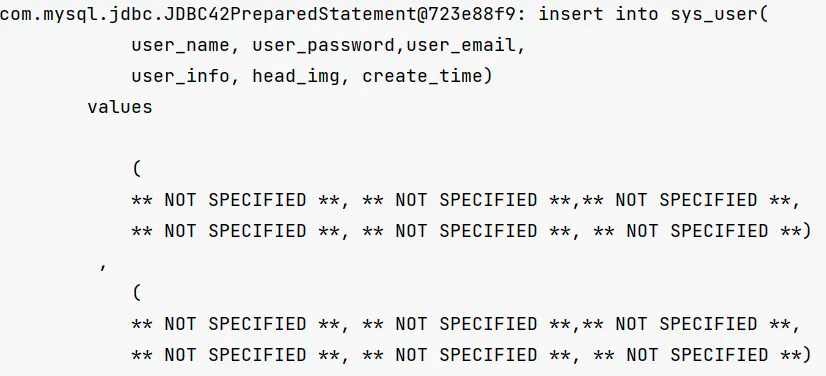
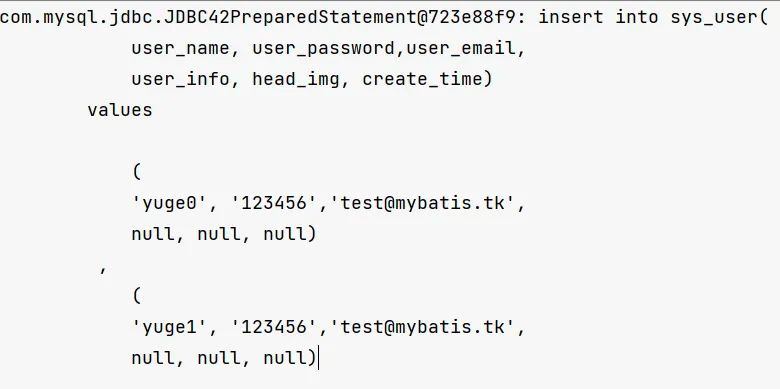
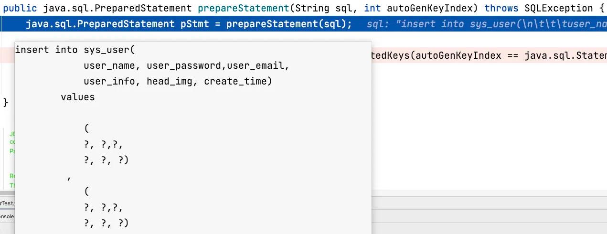
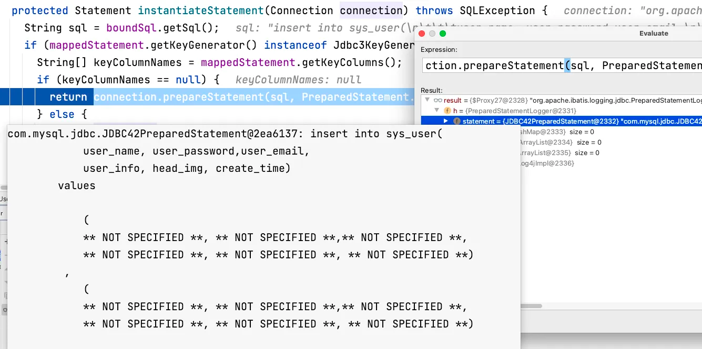

```java
public interface StatementHandler {

    //从连接中获取一个Statement
    Statement prepare(Connection connection, Integer transactionTimeout)
            throws SQLException;

    // 绑定 statement 执行时所需的实参
    void parameterize(Statement statement)
            throws SQLException;

    //批量执行 SQL 语句
    void batch(Statement statement)
            throws SQLException;

    //执行 update/insert/delete 语句
    int update(Statement statement)
            throws SQLException;

    //执行 select 语句
    <E> List<E> query(Statement statement, ResultHandler resultHandler)
            throws SQLException;

    //
    <E> Cursor<E> queryCursor(Statement statement)
            throws SQLException;

    BoundSql getBoundSql();

    ParameterHandler getParameterHandler();

}
```



- SimpleStatementHandler: 管理 Statement 对象并向数据库中推送不需要预编译的SQL语句
- PreparedStatementHandler: 管理 Statement 对象并向数据中推送需要预编译的SQL语句，
- CallableStatementHandler：管理 Statement 对象并调用数据库中的存储过程

# 3.5.1 RoutingStatementHandler

是 Executor 接口实现的基础。

根据 `MappedStatement` 中的`StatementType`，创建对应的`StatementHandler` 接口实现。

```java
public class RoutingStatementHandler implements StatementHandler {

    private final StatementHandler delegate;

    public RoutingStatementHandler(Executor executor, MappedStatement ms, Object parameter, RowBounds rowBounds, ResultHandler resultHandler, BoundSql boundSql) {

        switch (ms.getStatementType()) {
            case STATEMENT:
                delegate = new SimpleStatementHandler(executor, ms, parameter, rowBounds, resultHandler, boundSql);
                break;
            case PREPARED:
                delegate = new PreparedStatementHandler(executor, ms, parameter, rowBounds, resultHandler, boundSql);
                break;
            case CALLABLE:
                delegate = new CallableStatementHandler(executor, ms, parameter, rowBounds, resultHandler, boundSql);
                break;
            default:
                throw new ExecutorException("Unknown statement type: " + ms.getStatementType());
        }

    }

    @Override
    public Statement prepare(Connection connection, Integer transactionTimeout) throws SQLException {
        return delegate.prepare(connection, transactionTimeout);
    }

    @Override
    public void parameterize(Statement statement) throws SQLException {
        delegate.parameterize(statement);
    }

    @Override
    public void batch(Statement statement) throws SQLException {
        delegate.batch(statement);
    }

    @Override
    public int update(Statement statement) throws SQLException {
        return delegate.update(statement);
    }

    @Override
    public <E> List<E> query(Statement statement, ResultHandler resultHandler) throws SQLException {
        return delegate.<E>query(statement, resultHandler);
    }

    @Override
    public <E> Cursor<E> queryCursor(Statement statement) throws SQLException {
        return delegate.queryCursor(statement);
    }

    @Override
    public BoundSql getBoundSql() {
        return delegate.getBoundSql();
    }

    @Override
    public ParameterHandler getParameterHandler() {
        return delegate.getParameterHandler();
    }
}
```

# 3.5.2 BaseStatementHandler

提供了一些参数绑定相关的方法，没有实现操作数据库的方法

```java
public abstract class BaseStatementHandler implements StatementHandler {

    protected final Configuration configuration;
    protected final ObjectFactory objectFactory;
    protected final TypeHandlerRegistry typeHandlerRegistry;
    //记录使用的 ResultSetHandler 对象，主要功能是将结果集映射成结果对象
    protected final ResultSetHandler resultSetHandler;
    //ParameterHandler 的主要功能是为 SQL 语句绑定实参，也就是使用传入的实参替换 SQL 语句中的 "?"占位符
    protected final ParameterHandler parameterHandler;

    protected final Executor executor;
    //记录SQL语句对应的MappedStatement和BoundSql对象
    protected final MappedStatement mappedStatement;
    protected BoundSql boundSql;

    //用户设置的offset和limit，用于在结果集中定位映射的起始位置和结束位置
    protected final RowBounds rowBounds;


    protected BaseStatementHandler(Executor executor, MappedStatement mappedStatement, Object parameterObject, RowBounds rowBounds, ResultHandler resultHandler, BoundSql boundSql) {
        this.configuration = mappedStatement.getConfiguration();
        this.executor = executor;
        this.mappedStatement = mappedStatement;
        this.rowBounds = rowBounds;

        this.typeHandlerRegistry = configuration.getTypeHandlerRegistry();
        this.objectFactory = configuration.getObjectFactory();

        if (boundSql == null) { // issue #435, get the key before calculating the statement
            generateKeys(parameterObject);
            boundSql = mappedStatement.getBoundSql(parameterObject);
        }

        this.boundSql = boundSql;

        this.parameterHandler = configuration.newParameterHandler(mappedStatement, parameterObject, boundSql);
        this.resultSetHandler = configuration.newResultSetHandler(executor, mappedStatement, rowBounds, parameterHandler, resultHandler, boundSql);
    }

    @Override
    public Statement prepare(Connection connection, Integer transactionTimeout) throws SQLException {
        ErrorContext.instance().sql(boundSql.getSql());
        Statement statement = null;
        try {
            statement = instantiateStatement(connection);
            setStatementTimeout(statement, transactionTimeout);
            setFetchSize(statement);
            return statement;
        } catch (SQLException e) {
            closeStatement(statement);
            throw e;
        } catch (Exception e) {
            closeStatement(statement);
            throw new ExecutorException("Error preparing statement.  Cause: " + e, e);
        }
    }

    protected abstract Statement instantiateStatement(Connection connection) throws SQLException;

    protected void setStatementTimeout(Statement stmt, Integer transactionTimeout) throws SQLException {
        Integer queryTimeout = null;
        if (mappedStatement.getTimeout() != null) {
            queryTimeout = mappedStatement.getTimeout();
        } else if (configuration.getDefaultStatementTimeout() != null) {
            queryTimeout = configuration.getDefaultStatementTimeout();
        }
        if (queryTimeout != null) {
            stmt.setQueryTimeout(queryTimeout);
        }
        StatementUtil.applyTransactionTimeout(stmt, queryTimeout, transactionTimeout);
    }

    protected void setFetchSize(Statement stmt) throws SQLException {
        Integer fetchSize = mappedStatement.getFetchSize();
        if (fetchSize != null) {
            stmt.setFetchSize(fetchSize);
            return;
        }
        Integer defaultFetchSize = configuration.getDefaultFetchSize();
        if (defaultFetchSize != null) {
            stmt.setFetchSize(defaultFetchSize);
        }
    }

    protected void closeStatement(Statement statement) {
        try {
            if (statement != null) {
                statement.close();
            }
        } catch (SQLException e) {
            //ignore
        }
    }

    protected void generateKeys(Object parameter) {
        KeyGenerator keyGenerator = mappedStatement.getKeyGenerator();
        ErrorContext.instance().store();
        keyGenerator.processBefore(executor, mappedStatement, null, parameter);
        ErrorContext.instance().recall();
    }

}
```

依赖两个重要组件：**ResultSetHandler** 和 **ParameterHandler**

# 3.5.3 ParameterHandler

作用：**为 SQL 语句绑定实参**

```java
/**
 * A parameter handler sets the parameters of the {@code PreparedStatement}
 */
public interface ParameterHandler {

    Object getParameterObject();

    //调用PreparedStatement.set*()方法为SQL语句绑定实参
    void setParameters(PreparedStatement ps)
            throws SQLException;

}

```


**DefaultParameterHandler**

```java
public class DefaultParameterHandler implements ParameterHandler {

    //管理MyBatis中的全部TypeHandler
    private final TypeHandlerRegistry typeHandlerRegistry;
    //记录SQL节点相应的配置信息
    private final MappedStatement mappedStatement;
    //用户传入的实参对象
    private final Object parameterObject;
    //需要设置参数的PreparedStatement对象，就是根据该BoundSql中记录的SQL语句创建的，
    //BoundSql中也记录了对应参数的名称和相关属性
    private BoundSql boundSql;
    private Configuration configuration;

    //遍历boundSql.getParameterMappings()集合中记录的ParameterMapping 对象，并根据其中记录的参数名称查找相应实参，然后与 SQL 语句绑定
    @Override
    public void setParameters(PreparedStatement ps) {
        ErrorContext.instance().activity("setting parameters").object(mappedStatement.getParameterMap().getId());
        //取出sql中的参数映射列表
        //ParameterMapping{property='id', mode=IN, javaType=class java.lang.Object, jdbcType=null, numericScale=null, resultMapId='null', jdbcTypeName='null', expression='null'}
        List<ParameterMapping> parameterMappings = boundSql.getParameterMappings();
        if (parameterMappings != null) {
            for (int i = 0; i < parameterMappings.size(); i++) {
                ParameterMapping parameterMapping = parameterMappings.get(i);
                //过滤掉存储过程中的输出参数
                if (parameterMapping.getMode() != ParameterMode.OUT) {
                    Object value;//记录绑定的实参
                    String propertyName = parameterMapping.getProperty();//获取参数名称
                    if (boundSql.hasAdditionalParameter(propertyName)) { // 获取对应的实参值
                        value = boundSql.getAdditionalParameter(propertyName);
                    } else if (parameterObject == null) {//整个实参为空
                        value = null;
                    } else if (typeHandlerRegistry.hasTypeHandler(parameterObject.getClass())) {
                        value = parameterObject;  //实参可通过TypeHandler转换成JdbcType
                    } else {
                        //获取对象中相应的属性值或查找Map对象中值
                        MetaObject metaObject = configuration.newMetaObject(parameterObject);
                        value = metaObject.getValue(propertyName);
                    }
                    TypeHandler typeHandler = parameterMapping.getTypeHandler();
                    JdbcType jdbcType = parameterMapping.getJdbcType();
                    if (value == null && jdbcType == null) {
                        jdbcType = configuration.getJdbcTypeForNull();
                    }
                    try {
                        //调用PreparedStatement.set*()方法为SQL语句绑定相应的实参
                        typeHandler.setParameter(ps, i + 1, value, jdbcType);
                    } catch (TypeException e) {
                        throw new TypeException("Could not set parameters for mapping: " + parameterMapping + ". Cause: " + e, e);
                    } catch (SQLException e) {
                        throw new TypeException("Could not set parameters for mapping: " + parameterMapping + ". Cause: " + e, e);
                    }
                }
            }
        }
    }
}
```


->


为 SQL 语句绑定完实参后，就可以调用 Statement 对象相应的 execute() 方法，将 SQL 语句交给数据库执行

# 3.5.4 SimpleStatementHandler

- SimpleStatementHandler 用于执行非预编译的 SQL 语句，即每次执行 SQL 语句都会被解析和编译。
- 这种语句处理器适用于一些简单的 SQL 语句，不需要重复执行的场景，或者是一些动态拼接 SQL 的情况。
- 由于每次执行都需要重新解析和编译 SQL，因此在一些频繁执行的场景下可能会影响性能。

底层使用 java.sql.Statement 对象来完成数据库的相关操作

```java
public class SimpleStatementHandler extends BaseStatementHandler {

    public SimpleStatementHandler(Executor executor, MappedStatement mappedStatement, Object parameter, RowBounds rowBounds, ResultHandler resultHandler, BoundSql boundSql) {
        super(executor, mappedStatement, parameter, rowBounds, resultHandler, boundSql);
    }

    @Override
    public int update(Statement statement) throws SQLException {
        String sql = boundSql.getSql();
        Object parameterObject = boundSql.getParameterObject();
        KeyGenerator keyGenerator = mappedStatement.getKeyGenerator();
        int rows;
        if (keyGenerator instanceof Jdbc3KeyGenerator) {
            statement.execute(sql, Statement.RETURN_GENERATED_KEYS);
            rows = statement.getUpdateCount();
            keyGenerator.processAfter(executor, mappedStatement, statement, parameterObject);
        } else if (keyGenerator instanceof SelectKeyGenerator) {
            statement.execute(sql);
            rows = statement.getUpdateCount();
            keyGenerator.processAfter(executor, mappedStatement, statement, parameterObject);
        } else {
            statement.execute(sql);
            rows = statement.getUpdateCount();
        }
        return rows;
    }

    @Override
    public void batch(Statement statement) throws SQLException {
        String sql = boundSql.getSql();
        statement.addBatch(sql);
    }

    @Override
    public <E> List<E> query(Statement statement, ResultHandler resultHandler) throws SQLException {
        String sql = boundSql.getSql();
        statement.execute(sql);
        return resultSetHandler.handleResultSets(statement);
    }

    @Override
    public <E> Cursor<E> queryCursor(Statement statement) throws SQLException {
        String sql = boundSql.getSql();
        statement.execute(sql);
        return resultSetHandler.handleCursorResultSets(statement);
    }

    @Override
    protected Statement instantiateStatement(Connection connection) throws SQLException {
        if (mappedStatement.getResultSetType() == ResultSetType.DEFAULT) {
            return connection.createStatement();
        } else {
            return connection.createStatement(mappedStatement.getResultSetType().getValue(), ResultSet.CONCUR_READ_ONLY);
        }
    }

    @Override
    public void parameterize(Statement statement) {
        // N/A
    }

}
```

# 3.5.5 PreparedStatementHandler

- PreparedStatementHandler 用于执行预编译的 SQL 语句，即 SQL 语句在执行之前会被数据库预编译成二进制格式，然后可以多次执行。
- 这种语句处理器适用于需要重复执行的 SQL 语句，可以提高执行效率。
- 由于 SQL 语句在执行之前已经被编译成二进制格式，因此在执行时只需要传入参数即可，无需重新解析和编译 SQL，从而提高了执行效率。

```xml

<insert id="insertList" useGeneratedKeys="true" keyProperty="id">
    insert into sys_user(
    user_name, user_password,user_email,
    user_info, head_img, create_time)
    values
    <foreach collection="list" item="user" separator=",">
        (
        #{user.userName}, #{user.userPassword},#{user.userEmail},
        #{user.userInfo}, #{user.headImg, jdbcType=BLOB}, #{user.createTime, jdbcType=TIMESTAMP})
    </foreach>
</insert>
```

->


```java
public class PreparedStatementHandler extends BaseStatementHandler {
    protected Statement instantiateStatement(Connection connection) throws SQLException {
    String sql = boundSql.getSql();
    if (mappedStatement.getKeyGenerator() instanceof Jdbc3KeyGenerator) {
      String[] keyColumnNames = mappedStatement.getKeyColumns();
      if (keyColumnNames == null) {
        return connection.prepareStatement(sql, PreparedStatement.RETURN_GENERATED_KEYS);
      } else {
        return connection.prepareStatement(sql, keyColumnNames);
      }
    } else if (mappedStatement.getResultSetType() != null) {
      return connection.prepareStatement(sql, mappedStatement.getResultSetType().getValue(), ResultSet.CONCUR_READ_ONLY);
    } else {
      return connection.prepareStatement(sql);
    }
  }
}
```


