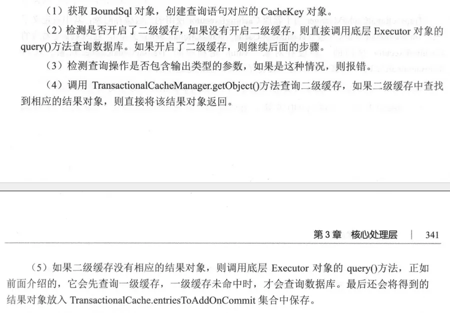
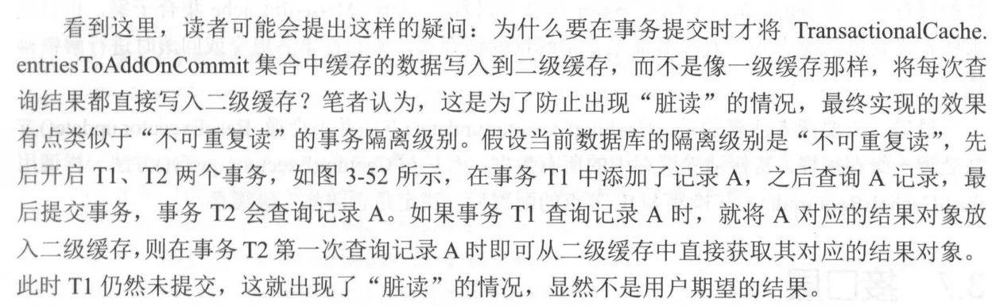

定义了数据库操作的基本方法。

实际应用中涉及的 SqlSession 接口的功能，都是基于 Executor 接口实现的.

```java
public interface Executor {

    ResultHandler NO_RESULT_HANDLER = null;

    //执行update,insert,delete三种类型的SQL语句
    int update(MappedStatement ms, Object parameter) throws SQLException;

    //执行select类型的SQL语句，返回值分为结果对象列表或游标对象
    <E> List<E> query(MappedStatement ms, Object parameter, RowBounds rowBounds, ResultHandler resultHandler, CacheKey cacheKey, BoundSql boundSql) throws SQLException;

    <E> List<E> query(MappedStatement ms, Object parameter, RowBounds rowBounds, ResultHandler resultHandler) throws SQLException;

    <E> Cursor<E> queryCursor(MappedStatement ms, Object parameter, RowBounds rowBounds) throws SQLException;

    //批量执行SQL语句
    List<BatchResult> flushStatements() throws SQLException;

    //提交事务
    void commit(boolean required) throws SQLException;

    //回滚事务
    void rollback(boolean required) throws SQLException;

    //创建缓存中用到的CacheKey对象
    CacheKey createCacheKey(MappedStatement ms, Object parameterObject, RowBounds rowBounds, BoundSql boundSql);

    //根据CacheKey对象查找缓存
    boolean isCached(MappedStatement ms, CacheKey key);

    //清空一级缓存
    void clearLocalCache();

    //延迟加载一级缓存中的数据
    void deferLoad(MappedStatement ms, MetaObject resultObject, String property, CacheKey key, Class<?> targetType);

    //获取事务对象
    Transaction getTransaction();

    //关闭Executor对象
    void close(boolean forceRollback);

    //检测Executor是否已经关闭
    boolean isClosed();

    void setExecutorWrapper(Executor executor);

}
```

Mybatis 中 Executor 接口实现


# 3.6.1 模板方法模式

# 3.6.2 BaseExecutor

主要提供了 _缓存管理_ 和 _事务管理_ 的基本功能。

子类实现四个基本方法( `doUpdate()`, `doFlushStatements()`, `doQuery()`, `doQueryCursor()` )完成数据库相关操作。

```java
public abstract class BaseExecutor implements Executor {
    //实现事务的提交、回滚和关闭操作
    protected Transaction transaction;
    protected Executor wrapper;

    //延迟加载队列
    protected ConcurrentLinkedQueue<DeferredLoad> deferredLoads;
    //一级缓存，用于缓存该Executor对象查询结果集映射得到的jieguoduixiang
    protected PerpetualCache localCache;
    //一级缓存，用于缓存输出类型的参数
    protected PerpetualCache localOutputParameterCache;
    protected Configuration configuration;
    //用来记录嵌套查询的层数
    protected int queryStack = 0;
    private boolean closed;

    public int update(MappedStatement ms, Object parameter) throws SQLException {
        ErrorContext.instance().resource(ms.getResource()).activity("executing an update").object(ms.getId());
        if (closed) {
            throw new ExecutorException("Executor was closed.");
        }
        clearLocalCache();
        return doUpdate(ms, parameter);
    }

    public List<BatchResult> flushStatements(boolean isRollBack) throws SQLException {
        if (closed) {
            throw new ExecutorException("Executor was closed.");
        }
        return doFlushStatements(isRollBack);
    }

    private <E> List<E> queryFromDatabase(MappedStatement ms, Object parameter, RowBounds rowBounds, ResultHandler resultHandler, CacheKey key, BoundSql boundSql) throws SQLException {
        List<E> list;
        localCache.putObject(key, EXECUTION_PLACEHOLDER);
        try {
            list = doQuery(ms, parameter, rowBounds, resultHandler, boundSql);
        } finally {
            localCache.removeObject(key);
        }
        localCache.putObject(key, list);
        if (ms.getStatementType() == StatementType.CALLABLE) {
            localOutputParameterCache.putObject(key, parameter);
        }
        return list;
    }
}
```

## 1. 一级缓存简介

一级缓存是会话级别的缓存，在 MyBatis 中每创建一个 SqlSession 对象，就表示开启一次数据库会话。

会将每次查询的结果对象缓存起来。（完全一样的查询语句直接从一级缓存中获取）

## 2. 一级缓存的管理


```java
public abstract class BaseExecutor implements Executor {
    public <E> List<E> query(MappedStatement ms, Object parameter, RowBounds rowBounds, ResultHandler resultHandler) throws SQLException {
        BoundSql boundSql = ms.getBoundSql(parameter);
        CacheKey key = createCacheKey(ms, parameter, rowBounds, boundSql);
        return query(ms, parameter, rowBounds, resultHandler, key, boundSql);
    }

    public <E> List<E> query(MappedStatement ms, Object parameter, RowBounds rowBounds, ResultHandler resultHandler, CacheKey key, BoundSql boundSql) throws SQLException {
        ErrorContext.instance().resource(ms.getResource()).activity("executing a query").object(ms.getId());
        if (closed) {
            throw new ExecutorException("Executor was closed.");
        }
        //非嵌套查询，并且＜select＞节点配置的 flushCache 属性为 true 时，才会清空一级缓存
        if (queryStack == 0 && ms.isFlushCacheRequired()) {
            clearLocalCache();
        }
        List<E> list;
        try {
            // 加查询层数
            queryStack++;
            //查询一级缓存
            list = resultHandler == null ? (List<E>) localCache.getObject(key) : null;
            if (list != null) {
                //针对存储过程调用的处理 其功能是 在一级缓存命中时，获取缓存中保存的输出类型参数，
                //并设置到用户传入的实参（ parameter ）对象中
                handleLocallyCachedOutputParameters(ms, key, parameter, boundSql);
            } else {
                list = queryFromDatabase(ms, parameter, rowBounds, resultHandler, key, boundSql);
            }
        } finally {
            queryStack--;//当前查询完成，查询层数减少
        }
        if (queryStack == 0) {
            //在最外层的查询结束时，所有嵌套查询也已经完成，相关缓存项也已经完全加载，所以在这里可以触发 
            //DeferredLoad 加载一级缓存中记录的嵌套查询的结果对象
            for (DeferredLoad deferredLoad : deferredLoads) {
                deferredLoad.load();
            }

            deferredLoads.clear();
            if (configuration.getLocalCacheScope() == LocalCacheScope.STATEMENT) {
                clearLocalCache();
            }
        }
        return list;
    }
}
```

```java
public abstract class BaseExecutor implements Executor {
    private <E> List<E> queryFromDatabase(MappedStatement ms, Object parameter, RowBounds rowBounds, ResultHandler resultHandler, CacheKey key, BoundSql boundSql) throws SQLException {
        List<E> list;
        //缓存中添加占位符（占位符被删除后才可在缓存中查询）
        localCache.putObject(key, EXECUTION_PLACEHOLDER);
        try {
            //完成数据库查询操作，并返回结果对象
            list = doQuery(ms, parameter, rowBounds, resultHandler, boundSql);
        } finally {
            //删除占位符
            localCache.removeObject(key);
        }
        //将真正的结果对象添加到一级缓存中
        localCache.putObject(key, list);
        //是否为存储过程调用
        if (ms.getStatementType() == StatementType.CALLABLE) {
            localOutputParameterCache.putObject(key, parameter);//缓存输出参数的类型
        }
        return list;
    }
}
```

上面介绍了 BaseExecutor 中缓存的功能：

一：缓存查询得到的结果对象。

二：前面在分析嵌套查询时，如果一级缓存中缓存了嵌套查询的结果对象，则可以从一级缓存中直接加载该结果对象; 如果一级缓存中记录的嵌套查询的结果对象并未完全加载，则可以通过 DeferredLoad 实现类似延迟加载的功能。

相关的两个方法

### isCached()

```java
public abstract class BaseExecutor implements Executor {
    public boolean isCached(MappedStatement ms, CacheKey key) {
        return localCache.getObject(key) != null;
    }
}
```

### deferLoad()

创建 DeferredLoad 对象并将其添加到 deferredLoads 集合中

```java
public abstract class BaseExecutor implements Executor {
    public void deferLoad(MappedStatement ms, MetaObject resultObject, String property, CacheKey key, Class<?> targetType) {
        if (closed) {
            throw new ExecutorException("Executor was closed.");
        }
        //创建DeferredLoad对象
        DeferredLoad deferredLoad = new DeferredLoad(resultObject, property, key, localCache, configuration, targetType);
        if (deferredLoad.canLoad()) {
            //一级缓存中已经记录了指定查询的结果对象，直接从缓存中加载对象，并设置到外层对象中
            deferredLoad.load();
        } else {
            //将 DeferredLoad 对象添加到 deferredLoads 队列中，待整个外层查询结束后，再加载该结果对象
            deferredLoads.add(new DeferredLoad(resultObject, property, key, localCache, configuration, targetType));
        }
    }
}
```

#### DeferredLoad

从 localCache 缓存中延迟加载结果对象

```java
private static class DeferredLoad {

    private final MetaObject resultObject;
    private final String property;//延迟加载的属性名称
    private final Class<?> targetType;//延迟加载的属性类型
    private final CacheKey key;
    private final PerpetualCache localCache;
    private final ObjectFactory objectFactory;
    private final ResultExtractor resultExtractor;//负责结果对象的类型转换

    //检测缓存项是否已经完全加载到了缓存中。
    //完全加载：BaseExecutor.queryFromDatabase()中，结果已经查询到，占位符被删除（见上文）
    public boolean canLoad() {
        return localCache.getObject(key) != null && localCache.getObject(key) != EXECUTION_PLACEHOLDER;
    }

    public void load() {
        List<Object> list = (List<Object>) localCache.getObject(key);
        //将缓存的结果对象转换为指定类型
        Object value = resultExtractor.extractObjectFromList(list, targetType);
        //设置到外层对象的对应属性
        resultObject.setValue(property, value);
    }
}
```

### clearLocalCache()

缓存清除

```java
public abstract class BaseExecutor implements Executor {
    public void clearLocalCache() {
        if (!closed) {
            localCache.clear();
            localOutputParameterCache.clear();
        }
    }
}
```

## 3.事务相关操作

`Executor.flushStatements()`方法主要针对批处理多条 SQL 语句，它会调用 `doFlushStatements` 这个基本方法处理 `Executor` 中缓存的多条 SQL 语句。

在 BaseExecutor.commit()、rollback()等方法中都会先调用 flushStatements()方法，然后再执行相关事务操作。

### commit()

```java
public abstract class BaseExecutor implements Executor {
    public void commit(boolean required) throws SQLException {
        if (closed) {
            throw new ExecutorException("Cannot commit, transaction is already closed");
        }
        clearLocalCache();//清空一级缓存
        flushStatements();//执行缓存的SQL语句，其中调用了flushStatements(false)
        if (required) {
            transaction.commit();
        }
    }

    public List<BatchResult> flushStatements() throws SQLException {
        return flushStatements(false);
    }
}

```

### rollback()

```java
public abstract class BaseExecutor implements Executor {
    public void rollback(boolean required) throws SQLException {
        if (!closed) {
            try {
                clearLocalCache();
                //Executor中缓存的SQL语句都被忽略（不被发送到数据库执行）
                flushStatements(true);
            } finally {
                if (required) {
                    transaction.rollback();
                }
            }
        }
    }
}
```

### flushStatements()

```java
public abstract class BaseExecutor implements Executor {
    //isRollBack:是否执行Executor中缓存的SQL语句，false-执行，true-不执行
    public List<BatchResult> flushStatements(boolean isRollBack) throws SQLException {
        if (closed) {
            throw new ExecutorException("Executor was closed.");
        }
        return doFlushStatements(isRollBack);
    }
}
```

### close()

```java
public abstract class BaseExecutor implements Executor {
    public void close(boolean forceRollback) {
        try {
            try {
                rollback(forceRollback);
            } finally {
                if (transaction != null) {
                    transaction.close();
                }
            }
        } catch (SQLException e) {
            // Ignore.  There's nothing that can be done at this point.
            log.warn("Unexpected exception on closing transaction.  Cause: " + e);
        } finally {
            transaction = null;
            deferredLoads = null;
            localCache = null;
            localOutputParameterCache = null;
            closed = true;
        }
    }
}
```

# 3.6.3 SimpleExecutor

## doQuery()

```java
public class SimpleExecutor extends BaseExecutor {
    public <E> List<E> doQuery(MappedStatement ms, Object parameter, RowBounds rowBounds, ResultHandler resultHandler, BoundSql boundSql) throws SQLException {
        Statement stmt = null;
        try {
            Configuration configuration = ms.getConfiguration();
            //根据MappedStatement.statementType选择具体的StatementHandler实现
            StatementHandler handler = configuration.newStatementHandler(wrapper, ms, parameter, rowBounds, resultHandler, boundSql);
            //完成Statement的创建和初始化，首先调用StatementHandler.prepare()创建Statement对象，      
            //然后调用StatementHandler.parameterize()处理占位符
            stmt = prepareStatement(handler, ms.getStatementLog());
            //执行SQL语句，并通过ResultSetHandler完成结果集的映射
            return handler.<E>query(stmt, resultHandler);
        } finally {
            closeStatement(stmt);
        }
    }

}
```

### newStatementHandler()

```java
public class Configuration {
    public StatementHandler newStatementHandler(Executor executor, MappedStatement mappedStatement, Object parameterObject, RowBounds rowBounds, ResultHandler resultHandler, BoundSql boundSql) {
        StatementHandler statementHandler = new RoutingStatementHandler(executor, mappedStatement, parameterObject, rowBounds, resultHandler, boundSql);
        statementHandler = (StatementHandler) interceptorChain.pluginAll(statementHandler);
        return statementHandler;
    }
}
```

### prepareStatement()

```java
public class SimpleExecutor extends BaseExecutor {
    private Statement prepareStatement(StatementHandler handler, Log statementLog) throws SQLException {
        Statement stmt;
        Connection connection = getConnection(statementLog);
        stmt = handler.prepare(connection, transaction.getTimeout());
        handler.parameterize(stmt);
        return stmt;
    }
}
```

### prepare()

```java
public abstract class BaseStatementHandler implements StatementHandler {
    public Statement prepare(Connection connection, Integer transactionTimeout) throws SQLException {
        ErrorContext.instance().sql(boundSql.getSql());
        Statement statement = null;
        try {
            statement = instantiateStatement(connection);
            setStatementTimeout(statement, transactionTimeout);
            setFetchSize(statement);
            return statement;
        } catch (SQLException e) {
            closeStatement(statement);
            throw e;
        } catch (Exception e) {
            closeStatement(statement);
            throw new ExecutorException("Error preparing statement.  Cause: " + e, e);
        }
    }
}
```

## doFlushStatements()

不提供批量处理 SQL 语句的功能

```java
public class SimpleExecutor extends BaseExecutor {
    public List<BatchResult> doFlushStatements(boolean isRollback) throws SQLException {
        return Collections.emptyList();
    }
}
```

# 3.6.4 ReuseExecutor

重用 `Statement` 对象是常用的一种优化手段，该优化手段可以减少 SQL 预编译的开销以及创建和销毁 `Statement` 对象的开销，从而提高性能。

`private final Map<String, Statement> statementMap = new HashMap<String, Statement>();`
key-SQL 语句，value-SQL 对应的 Statement 对象

ReuseExecutor.doQuery()、doQueryCursor()、doUpdate()方法的实现与 SimpleExecutor 中对应方法的实现一样，区别在于其中调用的 prepareStatement()
方法，SimpleExecutor 每次都会通过 JDBC Connection 创建新的 Statement 对象，而 ReuseExecutor 则会尝试重用 StatementMap 中缓存的 Statement 对象

## prepareStatement()

```java
public class ReuseExecutor extends BaseExecutor {
    private Statement prepareStatement(StatementHandler handler, Log statementLog) throws SQLException {
        Statement stmt;
        BoundSql boundSql = handler.getBoundSql();
        String sql = boundSql.getSql();//获取SQL语句
        if (hasStatementFor(sql)) {//检测是否缓存了相同模式的SQL语句所对应的Statement对象
            stmt = getStatement(sql);//获取缓存的Statement对象
            applyTransactionTimeout(stmt);//修改超时时间
        } else {
            Connection connection = getConnection(statementLog);//获取数据库连接
            //创建新的Statement对象，并缓存到statementMap集合中
            stmt = handler.prepare(connection, transaction.getTimeout());
            putStatement(sql, stmt);
        }
        handler.parameterize(stmt);//处理占位符
        return stmt;
    }
}

```

## doFlushStatements()

当事务提交、回滚、连接关闭时，都需要关闭这些缓存的 Statement 对象

```java
public class ReuseExecutor extends BaseExecutor {
    public List<BatchResult> doFlushStatements(boolean isRollback) throws SQLException {
        for (Statement stmt : statementMap.values()) {
            closeStatement(stmt);
        }
        statementMap.clear();
        return Collections.emptyList();
    }
}
```

# 3.6.5 BatchExecutor

通过批量处理，在客户端缓存多条 SQL 语句。之后将多条 SQL 语句打包发送给数据库执行，从而减少网络方面的开销，提升系统的性能。

## 核心字段

```java
public class BatchExecutor extends BaseExecutor {
    //缓存多个statement对象，其中每个Statement对象中都缓存了多条SQL语句
    private final List<Statement> statementList = new ArrayList<Statement>();
    //记录批处理的结果
    private final List<BatchResult> batchResultList = new ArrayList<BatchResult>();
    private String currentSql;//当前执行的SQL语句
    private MappedStatement currentStatement;//当前执行的MappedStatement对象
}

```

## doUpdate()

```java
public class BatchExecutor extends BaseExecutor {
    public int doUpdate(MappedStatement ms, Object parameterObject) throws SQLException {
        final Configuration configuration = ms.getConfiguration();
        final StatementHandler handler = configuration.newStatementHandler(this, ms, parameterObject, RowBounds.DEFAULT, null, null);
        final BoundSql boundSql = handler.getBoundSql();
        final String sql = boundSql.getSql();
        final Statement stmt;
        if (sql.equals(currentSql) && ms.equals(currentStatement)) {
            int last = statementList.size() - 1;
            stmt = statementList.get(last);
            applyTransactionTimeout(stmt);
            handler.parameterize(stmt);// fix Issues 322
            BatchResult batchResult = batchResultList.get(last);
            batchResult.addParameterObject(parameterObject);
        } else {
            Connection connection = getConnection(ms.getStatementLog());
            stmt = handler.prepare(connection, transaction.getTimeout());
            handler.parameterize(stmt);    // fix Issues 322
            currentSql = sql;
            currentStatement = ms;
            statementList.add(stmt);
            batchResultList.add(new BatchResult(ms, sql, parameterObject));
        }
        handler.batch(stmt);
        return BATCH_UPDATE_RETURN_VALUE;
    }
}
```


```java
public class BatchExecutor extends BaseExecutor {
    public List<BatchResult> doFlushStatements(boolean isRollback) throws SQLException {
        try {
            List<BatchResult> results = new ArrayList<BatchResult>();
            //如采明确指定了要回滚事务，则直接返回空集合，忽略 statementList 集合中记录的 SQL 语句
            if (isRollback) {
                return Collections.emptyList();
            }
            for (int i = 0, n = statementList.size(); i < n; i++) {
                Statement stmt = statementList.get(i);
                applyTransactionTimeout(stmt);
                BatchResult batchResult = batchResultList.get(i);
                try {
                    //调用 Statement executeBatch() 方法批量执行其中$己录的 SQL 语句
                    batchResult.setUpdateCounts(stmt.executeBatch());
                    MappedStatement ms = batchResult.getMappedStatement();
                    List<Object> parameterObjects = batchResult.getParameterObjects();
                    KeyGenerator keyGenerator = ms.getKeyGenerator();
                    if (Jdbc3KeyGenerator.class.equals(keyGenerator.getClass())) {
                        Jdbc3KeyGenerator jdbc3KeyGenerator = (Jdbc3KeyGenerator) keyGenerator;
                        jdbc3KeyGenerator.processBatch(ms, stmt, parameterObjects);
                    } else if (!NoKeyGenerator.class.equals(keyGenerator.getClass())) { //issue #141
                        for (Object parameter : parameterObjects) {
                            keyGenerator.processAfter(this, ms, stmt, parameter);
                        }
                    }
                } catch (BatchUpdateException e) {
                    StringBuilder message = new StringBuilder();
                    message.append(batchResult.getMappedStatement().getId())
                            .append(" (batch index #")
                            .append(i + 1)
                            .append(")")
                            .append(" failed.");
                    if (i > 0) {
                        message.append(" ")
                                .append(i)
                                .append(" prior sub executor(s) completed successfully, but will be rolled back.");
                    }
                    throw new BatchExecutorException(message.toString(), e, results, batchResult);
                }
                results.add(batchResult);
            }
            return results;
        } finally {
            for (Statement stmt : statementList) {
                closeStatement(stmt);
            }
            currentSql = null;
            statementList.clear();
            batchResultList.clear();
        }
    }
}
```

# 3.6.6 CachingExecutor

为 Executor 增加了二级缓存的相关功能

## 1.二级缓存简介


## 2.TransactionalCache&TransactionalCacheManager

CachingExecutor 依赖的两个组件

主要作用：保存在某个 SqlSession 的某个事务中需要向某个二级缓存中添加的缓存数据

### TransactionalCache

```java

/**
 * The 2nd level cache transactional buffer.
 *
 * This class holds all cache entries that are to be added to the 2nd level cache during a Session.
 * Entries are sent to the cache when commit is called or discarded if the Session is rolled back. 
 * Blocking cache support has been added. Therefore any get() that returns a cache miss 
 * will be followed by a put() so any lock associated with the key can be released. 
 */
public class TransactionalCache implements Cache {

    private static final Log log = LogFactory.getLog(TransactionalCache.class);

    //底层封装的二级缓存所对应的 Cache 对象
    private Cache delegate;
    // 该字段为 true 时，则表示当前 TransactionalCache 不可查询， 且提交事务时会将底层 Cache 清空
    private boolean clearOnCommit;
    //暂时记录添加到 TransactionalCache 中的数据.在事务提交时，会将其中的数据添加到二级缓存中
    private Map<Object, Object> entriesToAddOnCommit;
    //记录缓存未命中的CacheKey对象
    private Set<Object> entriesMissedInCache;

}
```

#### putObject()

将结果对象先暂时保存在 `entriesToAddOnCommit` 集合中，在事务提交时才将这些结果对象添加到二级缓存中

```java
public class TransactionalCache implements Cache {

    public void putObject(Object key, Object object) {
        entriesToAddOnCommit.put(key, object);
    }

    public void commit() {
        if (clearOnCommit) {
            delegate.clear();
        }
        flushPendingEntries();
        reset();
    }

    private void flushPendingEntries() {
        for (Map.Entry<Object, Object> entry : entriesToAddOnCommit.entrySet()) {
            delegate.putObject(entry.getKey(), entry.getValue());
        }
        for (Object entry : entriesMissedInCache) {
            if (!entriesToAddOnCommit.containsKey(entry)) {
                delegate.putObject(entry, null);
            }
        }
    }
}

```

#### getObject()

```java
public class TransactionalCache implements Cache {
    public Object getObject(Object key) {

        Object object = delegate.getObject(key);
        if (object == null) {
            entriesMissedInCache.add(key);
        }

        if (clearOnCommit) {
            return null;
        } else {
            return object;
        }
    }
}

```

#### clear()

```java
public class TransactionalCache implements Cache {
    public void clear() {
        clearOnCommit = true;
        entriesToAddOnCommit.clear();
    }
}

```

#### rollback()

```java
public class TransactionalCache implements Cache {
    public void rollback() {
        unlockMissedEntries();
        reset();
    }
}

```

##### unlockMissedEntries()

```java
public class TransactionalCache implements Cache {
    private void unlockMissedEntries() {
        for (Object entry : entriesMissedInCache) {
            try {
                delegate.removeObject(entry);
            } catch (Exception e) {
                log.warn("Unexpected exception while notifiying a rollback to the cache adapter."
                        + "Consider upgrading your cache adapter to the latest version.  Cause: " + e);
            }
        }
    }
}

```

##### reset()

```java
public class TransactionalCache implements Cache {
    private void reset() {
        clearOnCommit = false;
        entriesToAddOnCommit.clear();
        entriesMissedInCache.clear();
    }
}

```

### TransactionalCacheManager

用于管理 CachingExecutor 使用的二级缓存对象

```java
public class TransactionalCacheManager {

    //key是CachingExecutor使用的二级缓存对象
    private Map<Cache, TransactionalCache> transactionalCaches = new HashMap<Cache, TransactionalCache>();

    public void clear(Cache cache) {
        getTransactionalCache(cache).clear();
    }

    public Object getObject(Cache cache, CacheKey key) {
        return getTransactionalCache(cache).getObject(key);
    }

    public void putObject(Cache cache, CacheKey key, Object value) {
        getTransactionalCache(cache).putObject(key, value);
    }

    public void commit() {
        for (TransactionalCache txCache : transactionalCaches.values()) {
            txCache.commit();
        }
    }

    public void rollback() {
        for (TransactionalCache txCache : transactionalCaches.values()) {
            txCache.rollback();
        }
    }

    private TransactionalCache getTransactionalCache(Cache cache) {
        TransactionalCache txCache = transactionalCaches.get(cache);
        if (txCache == null) {
            txCache = new TransactionalCache(cache);
            transactionalCaches.put(cache, txCache);
        }
        return txCache;
    }

}
```

## 3.CachingExecutor 的实现

### 核心字段

```java
public class CachingExecutor implements Executor {
    //用于执行数据库操作
    private Executor delegate;
    //管理缓存
    private TransactionalCacheManager tcm = new TransactionalCacheManager();
}
```

### query()



```java
public class CachingExecutor implements Executor {
    public <E> List<E> query(MappedStatement ms, Object parameterObject, RowBounds rowBounds, ResultHandler resultHandler) throws SQLException {
        BoundSql boundSql = ms.getBoundSql(parameterObject);
        CacheKey key = createCacheKey(ms, parameterObject, rowBounds, boundSql);
        return query(ms, parameterObject, rowBounds, resultHandler, key, boundSql);
    }

    public <E> List<E> query(MappedStatement ms, Object parameterObject, RowBounds rowBounds, ResultHandler resultHandler, CacheKey key, BoundSql boundSql)
            throws SQLException {
        Cache cache = ms.getCache();//查询语句所在命名空间对应的二级缓存
        if (cache != null) {
            flushCacheIfRequired(ms);//根据<select>节点的配置，决定是否需要清空二级缓存
            if (ms.isUseCache() && resultHandler == null) {
                //二级缓存不能保存输出类型的参数 如果查询操作调用了包含输出参数的存储过程，则报错
                ensureNoOutParams(ms, parameterObject, boundSql);
                //查询二级缓存
                List<E> list = (List<E>) tcm.getObject(cache, key);
                if (list == null) {
                    list = delegate.<E>query(ms, parameterObject, rowBounds, resultHandler, key, boundSql);
                    tcm.putObject(cache, key, list); // issue #578 and #116
                }
                return list;
            }
        }
        return delegate.<E>query(ms, parameterObject, rowBounds, resultHandler, key, boundSql);
    }
}

```

### 多线程时的线程安全问题


#### CacheBuilder.build()

`CacheBuilder.setStandardDecorators()`方法为 `PerpetualCache` 类型的 `Cache` 对象添加 `SynchronizedCache` 装饰器，

```java
public class CacheBuilder {
    public Cache build() {
        setDefaultImplementations();
        Cache cache = newBaseCacheInstance(implementation, id);
        setCacheProperties(cache);
        // issue #352, do not apply decorators to custom caches
        if (PerpetualCache.class.equals(cache.getClass())) {
            for (Class<? extends Cache> decorator : decorators) {
                cache = newCacheDecoratorInstance(decorator, cache);
                setCacheProperties(cache);
            }
            cache = setStandardDecorators(cache);
        } else if (!LoggingCache.class.isAssignableFrom(cache.getClass())) {
            cache = new LoggingCache(cache);
        }
        return cache;
    }

    private Cache setStandardDecorators(Cache cache) {
        try {
            MetaObject metaCache = SystemMetaObject.forObject(cache);
            if (size != null && metaCache.hasSetter("size")) {
                metaCache.setValue("size", size);
            }
            if (clearInterval != null) {
                cache = new ScheduledCache(cache);
                ((ScheduledCache) cache).setClearInterval(clearInterval);
            }
            if (readWrite) {
                cache = new SerializedCache(cache);
            }
            cache = new LoggingCache(cache);
            cache = new SynchronizedCache(cache);
            if (blocking) {
                cache = new BlockingCache(cache);
            }
            return cache;
        } catch (Exception e) {
            throw new CacheException("Error building standard cache decorators.  Cause: " + e, e);
        }
    }
}
```

```java
public class SynchronizedCache implements Cache {

    private Cache delegate;

    public SynchronizedCache(Cache delegate) {
        this.delegate = delegate;
    }

    public synchronized int getSize() {
        return delegate.getSize();
    }

    public synchronized void putObject(Object key, Object object) {
        delegate.putObject(key, object);
    }

    public synchronized Object getObject(Object key) {
        return delegate.getObject(key);
    }

    public synchronized Object removeObject(Object key) {
        return delegate.removeObject(key);
    }

    public synchronized void clear() {
        delegate.clear();
    }

}
```
## 4.一些疑问
- 为什么要在事务提交时才将 `TransactionalCache.entriesToAddOnCommit` 集合中缓存的数据写入到二级缓存


- TransactionalCache.entriesMissedInCache 集合的功能是什么？

