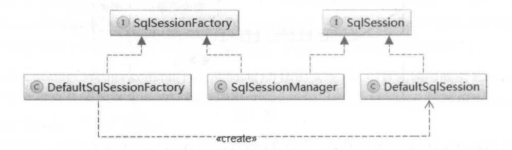
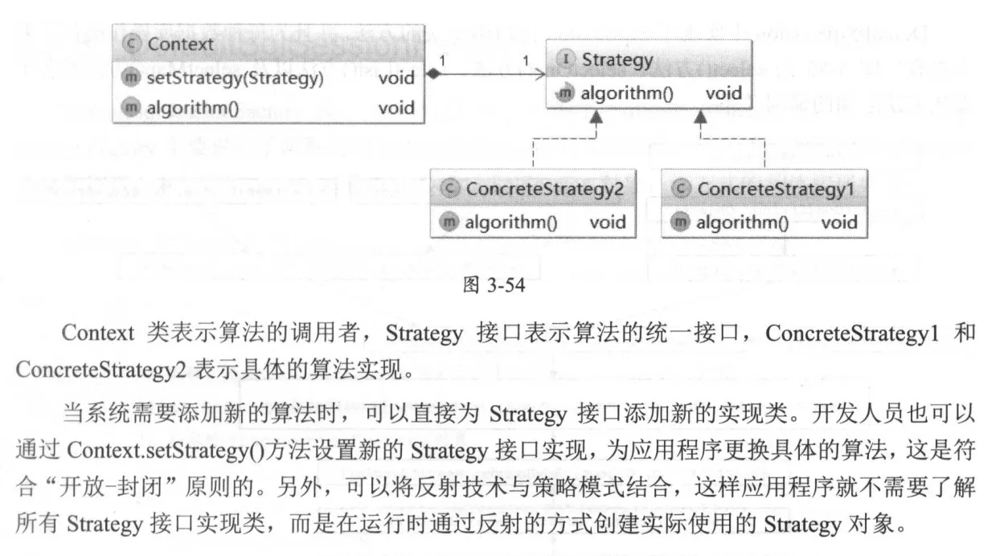
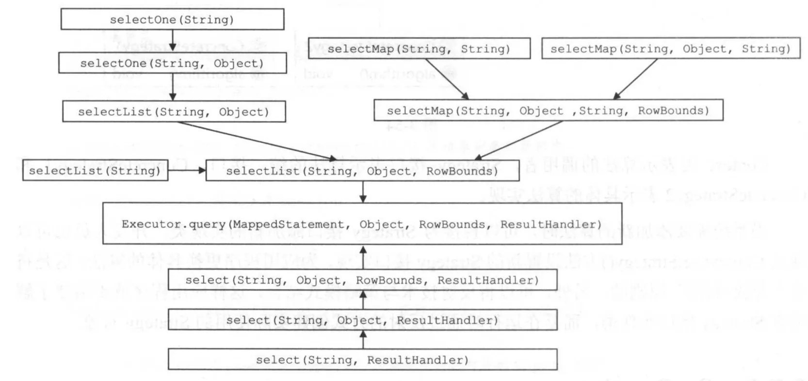

## SqlSession

定义了常用的数据库操作以及事务的相关操作

```java

/**
 * The primary Java interface for working with MyBatis.
 * Through this interface you can execute commands, get mappers and manage transactions.
 *
 * @author Clinton Begin
 */
public interface SqlSession extends Closeable {


    /**
     * Retrieve a single row mapped from the statement key and parameter.
     * @param <T> the returned object type
     * @param statement Unique identifier matching the statement to use.
     * @param parameter A parameter object to pass to the statement.
     * @return Mapped object
     */
    <T> T selectOne(String statement, Object parameter);

    <T> T selectOne(String statement);


    /**
     * Retrieve a list of mapped objects from the statement key and parameter,
     * within the specified row bounds.
     * @param <E> the returned list element type
     * @param statement Unique identifier matching the statement to use.
     * @param parameter A parameter object to pass to the statement.
     * @param rowBounds  Bounds to limit object retrieval
     * @return List of mapped object
     */
    <E> List<E> selectList(String statement, Object parameter, RowBounds rowBounds);

    <E> List<E> selectList(String statement);

    <E> List<E> selectList(String statement, Object parameter);


    /**
     * The selectMap is a special case in that it is designed to convert a list
     * of results into a Map based on one of the properties in the resulting
     * objects.
     * @param <K> the returned Map keys type
     * @param <V> the returned Map values type
     * @param statement Unique identifier matching the statement to use.
     * @param parameter A parameter object to pass to the statement.
     * @param mapKey The property to use as key for each value in the list.
     * @param rowBounds  Bounds to limit object retrieval
     * @return Map containing key pair data.
     */
    <K, V> Map<K, V> selectMap(String statement, Object parameter, String mapKey, RowBounds rowBounds);

    <K, V> Map<K, V> selectMap(String statement, String mapKey);

    <K, V> Map<K, V> selectMap(String statement, Object parameter, String mapKey);


    /**
     * A Cursor offers the same results as a List, except it fetches data lazily using an Iterator.
     * @param <T> the returned cursor element type.
     * @param statement Unique identifier matching the statement to use.
     * @param parameter A parameter object to pass to the statement.
     * @param rowBounds  Bounds to limit object retrieval
     * @return Cursor of mapped objects
     */
    <T> Cursor<T> selectCursor(String statement, Object parameter, RowBounds rowBounds);

    <T> Cursor<T> selectCursor(String statement);

    <T> Cursor<T> selectCursor(String statement, Object parameter);

    /**
     * Retrieve a single row mapped from the statement key and parameter
     * using a {@code ResultHandler} and {@code RowBounds}
     * @param statement Unique identifier matching the statement to use.
     * @param rowBounds RowBound instance to limit the query results
     * @param handler ResultHandler that will handle each retrieved row
     */
    void select(String statement, Object parameter, RowBounds rowBounds, ResultHandler handler);

    void select(String statement, Object parameter, ResultHandler handler);

    void select(String statement, ResultHandler handler);

    /**
     * Execute an insert statement with the given parameter object. Any generated
     * autoincrement values or selectKey entries will modify the given parameter
     * object properties. Only the number of rows affected will be returned.
     * @param statement Unique identifier matching the statement to execute.
     * @param parameter A parameter object to pass to the statement.
     * @return int The number of rows affected by the insert.
     */
    int insert(String statement, Object parameter);

    int insert(String statement);

    /**
     * Execute an update statement. The number of rows affected will be returned.
     */
    int update(String statement);

    int update(String statement, Object parameter);

    /**
     * Execute a delete statement. The number of rows affected will be returned.
     */
    int delete(String statement);

    int delete(String statement, Object parameter);

    /**
     * Flushes batch statements and commits database connection.
     * Note that database connection will not be committed if no updates/deletes/inserts were called.
     * To force the commit call {@link SqlSession#commit(boolean)}
     */
    void commit();

    /**
     * Flushes batch statements and commits database connection.
     */
    void commit(boolean force);

    /**
     * Discards pending batch statements and rolls database connection back.
     * Note that database connection will not be rolled back if no updates/deletes/inserts were called.
     * To force the rollback call {@link SqlSession#rollback(boolean)}
     */
    void rollback();

    /**
     * Discards pending batch statements and rolls database connection back.
     * Note that database connection will not be rolled back if no updates/deletes/inserts were called.
     * @param force forces connection rollback
     */
    void rollback(boolean force);

    /**
     * Flushes batch statements.
     */
    List<BatchResult> flushStatements();

    /**
     * Closes the session
     */
    void close();

    /**
     * Clears local session cache
     */
    void clearCache();

    /**
     * Retrieves current configuration
     */
    Configuration getConfiguration();

    /**
     * Retrieves a mapper.
     */
    <T> T getMapper(Class<T> type);

    /**
     * Retrieves inner database connection
     */
    Connection getConnection();
}

```

## SqlSessionFactory

负责创建 SqlSession 对象

```java
public interface SqlSessionFactory {

    SqlSession openSession();

    SqlSession openSession(boolean autoCommit);

    SqlSession openSession(Connection connection);

    SqlSession openSession(TransactionIsolationLevel level);

    SqlSession openSession(ExecutorType execType);

    SqlSession openSession(ExecutorType execType, boolean autoCommit);

    SqlSession openSession(ExecutorType execType, TransactionIsolationLevel level);

    SqlSession openSession(ExecutorType execType, Connection connection);

    Configuration getConfiguration();

}
```

# 3.7.1 策略模式



# 3.7.2 SqlSession

## DefaultSqlSession

`DefaultSqlSession` 中使用了策略模式， `DefaultSqlSession` 扮演 Context 的角色，将所有数据库相关的操作封装到 `Executor` 接口实现中，并通过 `executor`
字段选择不同的 `Executor` 实现


```java
public class DefaultSqlSession implements SqlSession {

    private Configuration configuration;
    private Executor executor;//底层依赖的Executor对象

    private boolean autoCommit;//是否自动提交事务
    private boolean dirty;//当前缓存中是否有脏数据
    //为防止用户忘记关闭已打开的游标对象，会通过 cursorList 字段记录由该 SqlSession 对象生成的游标
//对象，在 DefaultSqlSession.close() 方法中会统一关闭这些游标对象
    private List<Cursor<?>> cursorList;

    public DefaultSqlSession(Configuration configuration, Executor executor, boolean autoCommit) {
        this.configuration = configuration;
        this.executor = executor;
        this.dirty = false;
        this.autoCommit = autoCommit;
    }

    @Override
    public <T> T selectOne(String statement, Object parameter) {
        // Popular vote was to return null on 0 results and throw exception on too many.
        List<T> list = this.<T>selectList(statement, parameter);
        if (list.size() == 1) {
            return list.get(0);
        } else if (list.size() > 1) {
            throw new TooManyResultsException("Expected one result (or null) to be returned by selectOne(), but found: " + list.size());
        } else {
            return null;
        }
    }

    public <K, V> Map<K, V> selectMap(String statement, Object parameter, String mapKey, RowBounds rowBounds) {
        final List<? extends V> list = selectList(statement, parameter, rowBounds);
        final DefaultMapResultHandler<K, V> mapResultHandler = new DefaultMapResultHandler<K, V>(mapKey,
                configuration.getObjectFactory(), configuration.getObjectWrapperFactory(), configuration.getReflectorFactory());
        final DefaultResultContext<V> context = new DefaultResultContext<V>();
        for (V o : list) {
            context.nextResultObject(o);
            mapResultHandler.handleResult(context);
        }
        return mapResultHandler.getMappedResults();
    }


    @Override
    public <E> List<E> selectList(String statement, Object parameter, RowBounds rowBounds) {
        try {
            MappedStatement ms = configuration.getMappedStatement(statement);
            return executor.query(ms, wrapCollection(parameter), rowBounds, Executor.NO_RESULT_HANDLER);
        } catch (Exception e) {
            throw ExceptionFactory.wrapException("Error querying database.  Cause: " + e, e);
        } finally {
            ErrorContext.instance().reset();
        }
    }

    @Override
    public void select(String statement, Object parameter, RowBounds rowBounds, ResultHandler handler) {
        try {
            MappedStatement ms = configuration.getMappedStatement(statement);
            executor.query(ms, wrapCollection(parameter), rowBounds, handler);
        } catch (Exception e) {
            throw ExceptionFactory.wrapException("Error querying database.  Cause: " + e, e);
        } finally {
            ErrorContext.instance().reset();
        }
    }

    //insert()、update()、delete()方法最后通过调用DefaultSqlSession.update(Strin,Object)方法实现。
    @Override
    public int delete(String statement, Object parameter) {
        return update(statement, parameter);
    }

    @Override
    public int insert(String statement, Object parameter) {
        return update(statement, parameter);
    }

    @Override
    public int update(String statement, Object parameter) {
        try {
            dirty = true;
            MappedStatement ms = configuration.getMappedStatement(statement);
            return executor.update(ms, wrapCollection(parameter));
        } catch (Exception e) {
            throw ExceptionFactory.wrapException("Error updating database.  Cause: " + e, e);
        } finally {
            ErrorContext.instance().reset();
        }
    }

    @Override
    public void commit(boolean force) {
        try {
            executor.commit(isCommitOrRollbackRequired(force));
            dirty = false;
        } catch (Exception e) {
            throw ExceptionFactory.wrapException("Error committing transaction.  Cause: " + e, e);
        } finally {
            ErrorContext.instance().reset();
        }
    }

    @Override
    public void rollback(boolean force) {
        try {
            executor.rollback(isCommitOrRollbackRequired(force));
            dirty = false;
        } catch (Exception e) {
            throw ExceptionFactory.wrapException("Error rolling back transaction.  Cause: " + e, e);
        } finally {
            ErrorContext.instance().reset();
        }
    }

    @Override
    public List<BatchResult> flushStatements() {
        try {
            return executor.flushStatements();
        } catch (Exception e) {
            throw ExceptionFactory.wrapException("Error flushing statements.  Cause: " + e, e);
        } finally {
            ErrorContext.instance().reset();
        }
    }

    @Override
    public void close() {
        try {
            executor.close(isCommitOrRollbackRequired(false));
            closeCursors();
            dirty = false;
        } finally {
            ErrorContext.instance().reset();
        }
    }

    @Override
    public Connection getConnection() {
        try {
            return executor.getTransaction().getConnection();
        } catch (SQLException e) {
            throw ExceptionFactory.wrapException("Error getting a new connection.  Cause: " + e, e);
        }
    }

}
```

上述方法最终都通过调用`Executor.query(MappedStatement ms, Object parameter, RowBounds rowBounds, ResultHandler resultHandler)`
方法实现数据库查询，然后对结果对象进行了相应的调整。

决定是否提交/回滚事务

```java
public class DefaultSqlSession implements SqlSession {
    private boolean isCommitOrRollbackRequired(boolean force) {
        return (!autoCommit && dirty) || force;
    }
}
```

# 3.7.3 DefaultSqlSessionFactory

创建 `DefaultSqlSession` 对象的方式

- 通过数据源获取数据库连接并创建 Executor 对象以及 DefaultSqlSession 对象

```java
public class DefaultSqlSessionFactory implements SqlSessionFactory {
    private SqlSession openSessionFromDataSource(ExecutorType execType, TransactionIsolationLevel level, boolean autoCommit) {
        Transaction tx = null;
        try {
            //mybatis-config.xml配置文件中配置的Environment对象
            final Environment environment = configuration.getEnvironment();
            final TransactionFactory transactionFactory = getTransactionFactoryFromEnvironment(environment);
            tx = transactionFactory.newTransaction(environment.getDataSource(), level, autoCommit);
            final Executor executor = configuration.newExecutor(tx, execType);
            return new DefaultSqlSession(configuration, executor, autoCommit);
        } catch (Exception e) {
            closeTransaction(tx); // may have fetched a connection so lets call close()
            throw ExceptionFactory.wrapException("Error opening session.  Cause: " + e, e);
        } finally {
            ErrorContext.instance().reset();
        }
    }
}

```

- 用户提供数据库连接对象，DefaultSqlSessionFactory 会使用该数据库连接对象创建

```java
public class DefaultSqlSessionFactory implements SqlSessionFactory {
    private SqlSession openSessionFromConnection(ExecutorType execType, Connection connection) {
        try {
            boolean autoCommit;
            try {
                autoCommit = connection.getAutoCommit();
            } catch (SQLException e) {
                // Failover to true, as most poor drivers
                // or databases won't support transactions
                autoCommit = true;
            }
            final Environment environment = configuration.getEnvironment();
            final TransactionFactory transactionFactory = getTransactionFactoryFromEnvironment(environment);
            final Transaction tx = transactionFactory.newTransaction(connection);
            final Executor executor = configuration.newExecutor(tx, execType);
            return new DefaultSqlSession(configuration, executor, autoCommit);
        } catch (Exception e) {
            throw ExceptionFactory.wrapException("Error opening session.  Cause: " + e, e);
        } finally {
            ErrorContext.instance().reset();
        }
    }
}
```

# 3.7.4 SqlSessionManager

`SqlSessionManager implements SqlSessionFactory, SqlSession`

即同时提供了 SqlSessionFactory 创建 SqlSession 对象以及 SqlSession 操纵数据库的功能

## 核心字段

```java
public class SqlSessionManager implements SqlSessionFactory, SqlSession {
    //底层封装的SqlSessionFactory对象
    private final SqlSessionFactory sqlSessionFactory;
    private final SqlSession sqlSessionProxy;
    //记录一个与当前线程绑定的SqlSession对象
    private ThreadLocal<SqlSession> localSqlSession = new ThreadLocal<SqlSession>();
}
```

## 访问数据库两种模式

- 同一线程每次通过SqlSessionManager 对象访问数据库，都会创建新的 DefaultSession 对象完成数据库操作
- 通过localSqlSession 记录与当前线程绑定的 SqlSession 对象。避免在同一线程多次黄建 SqlSession 对象带来的性能损失

## 构造方法

```java
public class SqlSessionManager implements SqlSessionFactory, SqlSession {
    private SqlSessionManager(SqlSessionFactory sqlSessionFactory) {
        this.sqlSessionFactory = sqlSessionFactory;
        this.sqlSessionProxy = (SqlSession) Proxy.newProxyInstance(
                SqlSessionFactory.class.getClassLoader(),
                new Class[]{SqlSession.class},
                new SqlSessionInterceptor());
    }

    public static SqlSessionManager newInstance(SqlSessionFactory sqlSessionFactory) {
        return new SqlSessionManager(sqlSessionFactory);
    }
}

```

## openSession()

```java
public class SqlSessionManager implements SqlSessionFactory, SqlSession {
    public SqlSession openSession() {
        return sqlSessionFactory.openSession();
    }
}
```

## SqlSessionInterceptor

`SqlSessionManager` 中实现的 `SqlSession` 接口方法，例如 `select*()`、 `update()`等，直接调用 `sqlSessionProxy` 字段记录的 `SqlSession`
代理对象的相应方法实现的。

```java
public class SqlSessionManager implements SqlSessionFactory, SqlSession {
    public <T> T selectOne(String statement) {
        return sqlSessionProxy.<T>selectOne(statement);
    }

    public <E> List<E> selectList(String statement, Object parameter) {
        return sqlSessionProxy.<E>selectList(statement, parameter);
    }

    public int update(String statement) {
        return sqlSessionProxy.update(statement);
    }
}
```

```java
private class SqlSessionInterceptor implements InvocationHandler {

    public SqlSessionInterceptor() {
        // Prevent Synthetic Access
    }

    @Override
    public Object invoke(Object proxy, Method method, Object[] args) throws Throwable {
        //当前线程绑定的SqlSession对象
        final SqlSession sqlSession = SqlSessionManager.this.localSqlSession.get();
        if (sqlSession != null) { //第二种模式
            try {
                return method.invoke(sqlSession, args);
            } catch (Throwable t) {
                throw ExceptionUtil.unwrapThrowable(t);
            }
        } else { //第一种模式
            final SqlSession autoSqlSession = openSession();
            try {
                final Object result = method.invoke(autoSqlSession, args);
                autoSqlSession.commit();
                return result;
            } catch (Throwable t) {
                autoSqlSession.rollback();
                throw ExceptionUtil.unwrapThrowable(t);
            } finally {
                autoSqlSession.close();
            }
        }
    }
}
```


