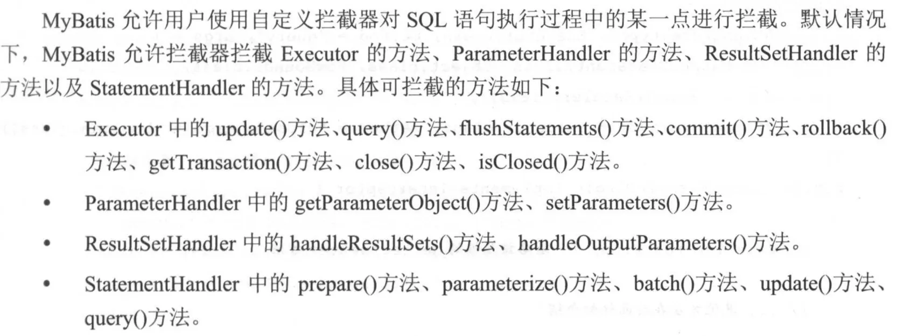

插件的功能通过 Interceptor 实现。涉及责任链模式和 JDK 动态代理

# 4.1.1 责任链模式

# 4.1.2 Interceptor



## 拦截器加载

`Mybatis` 中使用的拦截器都需要实现 `Interceptor` 接口

```java
public interface Interceptor {

    //执行拦截逻辑的方法
    Object intercept(Invocation invocation) throws Throwable;

    //决定是否触发 intercept()方法
    Object plugin(Object target);

    //根据配置初始化 Interceptor 对象
    void setProperties(Properties properties);

}
```


